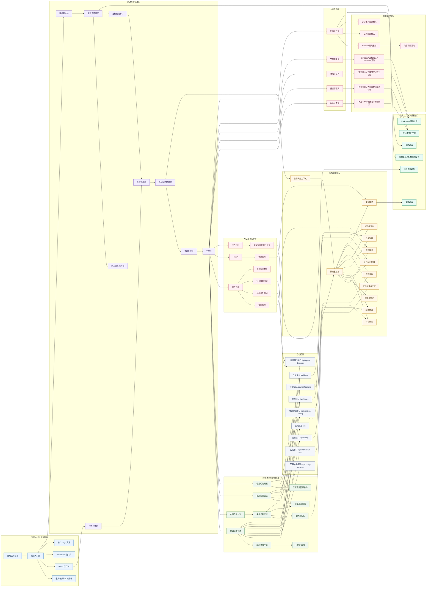
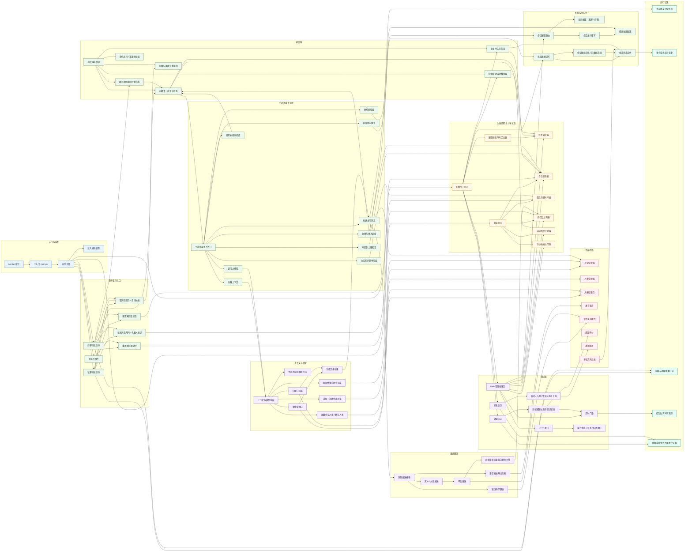

<!-- markdownlint-disable MD024 -->
<!-- markdownlint-disable MD028 -->
<!-- markdownlint-disable MD033 -->
<!-- markdownlint-disable MD041 -->


<div align="center">

简体中文 | [English](README_EN.md) | [日本語](README_JP.md)

</div>

<p align="center">
  
  
  
</p>

<p align="center">
  
  
  
</p>

<p align="center">
  
  
  
</p>

<p align="center">
  <a href="https://deepwiki.com/DBJD-CR/astrbot_plugin_proactive_chat" target="_blank"></a>
  <a href="https://zread.ai/DBJD-CR/astrbot_plugin_proactive_chat" target="_blank"></a>
</p>

[](https://github.com/DBJD-CR/astrbot_plugin_proactive_chat)


---

  一个为 [AstrBot](https://github.com/AstrBotDevs/AstrBot) 设计的、功能强大的主动消息插件。它能让你的 Bot 在特定的会话长时间没有新消息后，用一个随机的时间间隔，主动发起一次拥有上下文感知、符合人设且包含动态情绪的对话。

  如果你对 AI 带来的情感陪伴有需求，或者想让 ta 更加拟人，非常欢迎你来体验这个插件！

> [!IMPORTANT]
> 本插件基于较新版本的 AstrBot 进行开发，致力于打造一个高质量的，好用的主动消息插件。
>
> 一般情况下，推荐使用最新的 AstrBot 版本以获得最佳体验。
>
> 目前插件处于较为稳定的开发阶段，我也会持续维护本仓库与插件。

## 📑 快速导航

<div align="center">

| 左列 | 右列 |
| :--- | :--- |
| 1. [🌟 功能特色](#-功能特色) | 8. [🏗️ 系统架构](#️-系统架构) |
| 2. [✨ 效果示例](#-效果示例) | 9. [⚠️ 历史版本表格](#️-历史版本表格) |
| 3. [🚀 安装与使用](#-安装与使用) | 10. [❓ 常见问题简答](#-常见问题简答) |
| 4. [💻 现代化 WebUI 控制台](#-现代化-webui-控制台) | 11. [🚧 最新版本的已知限制](#-最新版本的已知限制) |
| 5. [🌐 平台适配情况](#-平台适配情况) | 12. [💖 友情链接与致谢](#-友情链接与致谢) |
| 6. [📑 插件配置项详解](#-插件配置项详解) | 13. [📚 推荐阅读](#-推荐阅读) |
| 7. [📂 插件目录与结构](#-插件目录与结构) | 14. [📞 联系我们](#-联系我们) |

</div>

---

<!-- Gemini 预留给开发者的话 -->
> **开发者的话：**
>
> 大家好，我是 DBJD-CR，初来乍到，请多关照。
>
> 这是我在 GitHub 上的首个仓库，也是第一次以开发者的身份参与到开源社区中，如果存在做的不好的地方还请理解。
>
> 今年的早些时候，我第一次了解到了 AstrBot 这个项目，但当时限于个人能力的不足，没有去深入研究。
>
> 现在经过了大半年的学习，以及参与体验了一些社区里的其他开源项目（主要是 [KouriChat](https://github.com/KouriChat/KouriChat) 和 [LingChat](https://github.com/SlimeBoyOwO/LingChat)），我觉得我有能力来学习这个项目了。
>
> 于是在前段时间，受到一位群友的启发后，我尝试并成功在本地部署了 AstrBot ，也为其高度成熟的开发生态和插件市场感到赞叹。
>
> 但我在插件市场逛了一圈后，发现偌大的市场里，竟然没有一个好用的 `主动消息` 的插件，只有类似 `主动回复` 的插件，但这不是我想要的。
>
> 此时，一个疯狂的想法在我的大脑里诞生了：**我要去做那个填补空白的人。**
>
> 如果我能写出一个主动消息的插件，那么我使用 AstrBot 的体验将完全不逊于 KouriChat ，也能让我那可怜的 2c2g 的云服务器少一点多线程任务压力（只需要部署一个 AstrBot 就行了）。抱着这样一点点"私心"，我踏上了我的插件开发之旅。
>
> **可我们面临一个严峻的问题**
>
> 这个插件的开发者，他的编程能力为 0 ，写一行" Hello World "的代码都费劲，在大学计算机基础公共课的 Python 期末考试的编程题中，他运用的思想是"面向结果编程"，他甚至学的不是计算机或人工智能相关的专业，还是个文科生。
>
> 因此对我而言，想要从 0 开始，开发一个插件，还要完成与 AstrBot 的适配，无异于天方夜谭。于是，我只能向 AI 求助。
>
> 所以，**本插件的所有文件内容，全部由 AI 编写完成**，我几乎没有为该插件编写任何一行代码，仅进行了架构设计，修改部分文字描述和负责本文档的润色。所以，或许有必要添加下方的声明：

> [!WARNING]  
> 本插件和文档由 AI 生成，内容仅供参考，请仔细甄别。

> 当然，使用 AI 开发插件，绝对不是一蹴而就的。由于 LLM 的能力限制，我们的插件开发过程异常艰难。我的工作流基本上就是：提出要求-运行 AI 写的代码-反馈报错信息-继续跑新代码
>
> 这个过程中我被 AI 折磨的相当痛苦，其代码中充斥着猜测与幻觉，甚至是由微小改动而导致的低级错误。还被 AI 带着在不同的实现路线之间兜圈子。我只能不断优化我的提示词，并且为其提供 AstrBot 的相关源码来让 AI 写出正确的代码。在开发的后期阶段，每次的 Tokens Used 甚至到达了惊人的 80w+ ，以至于 AI 已经无法精确理解并执行我的指令，输出也是一团乱麻，然后只能总结对话，重新开新对话聊。
>
> 要说本次开发最后悔的事，就是到了开发末期，我才看到了官方的插件开发文档。如果我能早点把这些文档发给 AI 的话，肯定能少走很多弯路了。想当初为了能正确导入插件并在 WebUI 中正确显示，都花了我几个小时的时间，更别说后面为了实现插件主功能的几十个版本了。
>
> 最终，经过了上百次迭代，以及三位 Gemini 的共同努力，我才开发出了插件的最初版本。
>
> 但我还是要感谢 AI ，没有他，这个项目不可能完成。
>
> 这个插件，是我们共同努力的结晶。它现在还不完美，但它的架构是稳固的，它的逻辑是清晰的（大嘘）。希望本插件能为同样希望自己的 AI Bot 更具"灵魂"的你，提供一点小小的帮助和启发。
>
> 在此，我也诚邀各路大佬对本插件进行测试和改进，希望大家多多指点。
>
> 如果你被这个"为爱发电"的故事打动了，**欢迎你为这个插件点个** 🌟 **Star** 🌟，这是对我们的最大认可与鼓励~

> [!NOTE]
> 虽然本插件的开发过程中大量使用了 AI 进行辅助，但我保证所有内容都经过了我的严格审查，所有的 AI 生成声明都是形式上的。你可以放心参观本仓库和使用本插件。
>
> 目前插件的主要功能都能正常运转。不过需要有好的提示词进行配合，才能获得理想的主动消息效果。
>
> 这是因为几乎所有实现主动消息的插件，都是通过发出一条**模拟的用户消息**来实现的，因此需要配合高质量的提示词，才能避免模型的回复"出戏"。
>
> 如果你觉得主动消息的效果不理想，可以尝试自己微调主动消息的提示词/优化人设/更换能力更好的模型/提供更丰富的上下文。
>
> 在 v1.0.0-beta.1 以及后续版本的开发中，我引入了新的 AI 模型和工作流进行开发，大幅提升了工作效率与代码质量。（现在回头看自己当初写插件的方式跟原始人似的😂）

> [!TIP]
> 本项目的相关开发数据 (持续更新中)：
>
> 开发时长：累计 60 天（主插件部分）
>
> 累计工时：约 300 小时（主插件部分）
>
> 使用的大模型：Gemini-2.5-Pro、Kimi For Coding、Gemini-3.0 Flash/Pro、GPT-5.3 & 5.4-Codex (With RooCode in VSCode)
>
> 用于测试对话的大模型：DeepSeek-V3.2-Exp & V3.2、Gemini-3.0-Flash
>
> 插件 Logo 绘制: Doubao-Seedream-3.0-t2i
>
> 对话窗口搭建：Chatbox 1.13.2、VSCode
>
> Tokens Used：668,002,273

## 🌟 功能特色

- **定时触发**: 基于用户沉默时间，在设定的随机时间范围内自动触发。
- **自动主动消息**: 插件每次重载时可以按需求自动开始创建主动消息任务，不需要用户输入来激活。
- **多会话支持**:支持同时为多个私聊和群聊提供主动消息服务，分别设置专属的配置和备注名。
- **会话完全隔离**: 每个会话拥有独立的状态、计数器、触发器，避免相互干扰。
- **上下文感知**: 能够回顾历史对话，并根据你设定的提示词，生成与之前话题相关的回复，而不是生硬的问候。
- **完整人格支持**: 加载并应用你为当前会话设置的专属人格，确保每一次主动消息都符合人设。
- **动态情绪**: 内置一个"未回复计数器"，你可以利用它在 Prompt 中设计不同的情绪表达，并且支持设置未回复上限。
- **持久化会话**: 无论您是"重启 AstrBot"还是"重载插件"，都能够从文件中恢复所有未执行的主动消息任务。
- **免打扰时段**: 可以自由设定一个时间段，在此期间 Bot 不会主动打扰用户。
- **TTS 集成**: 支持调用你配置的 TTS 服务生成语音。
- **分段回复**: 支持将长文本回复切分为多条短消息发送，并模拟真实的打字间隔，让对话更自然。
- **高度兼容**: 兼容其他需要对主动消息进行修饰的插件如表情包插件等。
- **快捷配置**: 所有核心配置都可以在 AstrBot 与插件自带的 WebUI 中轻松配置。快速上手，高效管理。无需修改任何代码，也无需学习和记忆任何插件指令。

## ✨ 效果示例

  

  

## 🚀 安装与使用

1. **下载插件**: 通过 AstrBot 的插件市场下载。或从本 GitHub 仓库的 Release 下载 `astrbot_plugin_proactive_chat` 的 `.zip` 文件，在 AstrBot WebUI 中的插件页面中选择 `从文件安装` 。
2. **安装依赖**: 本插件的核心依赖大多已包含在 AstrBot 的默认依赖中，且在插件下载安装时会自动安装插件所需的依赖，通常无需额外安装。如果你的环境中确实缺少相关依赖，请安装：

    ```bash
    pip install fastapi uvicorn
    # Python < 3.11 额外安装
    pip install "tomli>=2.0; python_version < '3.11'"
    ```

3. **重启 AstrBot (可选)**: 如果插件没有正常加载或生效，可以尝试重启你的 AstrBot 程序。
4. **配置插件**: 进入 WebUI，找到 `主动消息` 插件，选择 `插件配置` 选项，填写会话 UMO 列表和其他个性化配置。
5. **开始使用**: 保存配置后，等待 Bot 主动带给你的惊喜吧~

## 💻 现代化 WebUI 控制台

从 v1.2.0 版本开始，插件引入了全新的、功能完备的 WebUI 管理端。它围绕主动消息场景构建了一套可观测、可操作、可配置的轻量化控制台，并极大提高了插件运行状态的可见性。


### ✨ 核心亮点

- **五大核心视图**：
  - **📊 运行状态**：集中展示插件运行状态、调度器状态、会话数据量、WebSocket 连接数量，以及群沉默计时器 / 自动触发计时器的可视化卡片，便于快速判断“当前为什么还没触发”或“哪个会话正在倒计时”。
  - **🗂️ 任务管理**：统一查看当前所有待执行的主动消息任务，直观展示下一次执行时间、剩余倒计时、调度进度与未回复次数。支持对单个会话执行“立即触发”与“取消任务”。
  - **🔔 通知中心**：用于接收插件更新说明、修复通知、安全提醒与其他官方公告，支持未读统计、单条已读、全部已读与手动同步。
  - **📘 文档浏览**：直接在插件前端中查看仓库内的 Markdown 文档，例如 `README`、更新日志与 `docs/` 目录中的补充说明，适合在配置和排障时随手查阅。
  - **⚙️ 配置管理**：基于 Schema 动态渲染表单，支持插件主配置的可视化编辑，并提供会话差异覆写能力，让主动消息策略可以进行会话级的细粒度调整。

- **围绕“主动消息运维”设计的交互能力**：
  - **⏱️ 倒计时可视化**：无论是任务页中的正式调度任务，还是状态页中的群沉默计时器、自动触发计时器，都会以倒计时 + 状态标签 + 进度条的卡片形式展示。
  - **🧠 会话状态聚焦**：卡片中会突出显示会话备注名、UMO、未回复次数、目标触发时间等信息，方便快速定位具体会话。
  - **⚡ 快速运维操作**：支持手动刷新控制台数据、立即触发单个任务、取消错误或不再需要的任务，降低调试和日常维护成本。
  - **🔄 实时同步机制**：前端通过 WebSocket 接收运行态更新，并结合接口拉取完成状态校准，使页面在大多数情况下无需频繁手动刷新。

- **现代化前端体验**：
  - **🎨 现代化视觉风格**：控制台采用统一的卡片式布局、状态徽章、渐变强调色与亮暗主题适配，兼顾观感与信息密度。
  - **📱 响应式布局**：支持桌面端、平板与移动端浏览，临时用手机查看任务状态或快速改配置也没有太大压力。
  - **📝 阅读与编辑一体化**：配置编辑、通知阅读、文档浏览被整合进同一管理端，不需要在 AstrBot 原生配置页、仓库文档和运行日志之间频繁来回切换。

## 🌐 平台适配情况

| 消息平台 | 是否支持主动消息推送 | AstrBot 版本要求 | 官方文档备注 | 测试情况 |
| :--- | :--- | :--- | :--- | :--- |
| QQ 官方机器人 (Websockets 方式) | ✅ | v4.22.1+ | 主动消息推送：支持 | ✅ 社区反馈可用 |
| QQ 官方机器人 (Webhook 方式) | ✅ | v4.22.1+ | 主动消息推送：支持 | ✅ 社区反馈可用 |
| OneBot v11 (原 QQ 个人号) | ✅ | v4.8.0+ | 支持接入所有适配了 OneBotv11 反向 Websockets（AstrBot 做服务器端）的机器人协议端 | ✅ 开发者完整测试可用 |
| 企微应用 | ⚠️ | v4.15.0+ | 主动消息推送：企业微信应用支持，未测试企业微信客服。 | ❓ 等待社区反馈 |
| 企微智能机器人 | ✅ | v4.15.0+ | 主动消息推送：支持，但需要配置消息推送 Webhook URL。 | ❓ 等待社区反馈 |
| 微信公众号 | ❓ | v4.8.0+ | 未提供说明 | ❓ 等待社区反馈 |
| 个人微信 | ❓ | v4.22.0+ | 未提供准确说明 | ❓ 等待社区反馈 (但根据过往经验或许可用) |
| 飞书 | ✅ | v4.15.0+ | 主动消息推送：支持 | ✅ 社区反馈可用 |
| 钉钉 | ✅ | v4.15.0+ | 主动消息推送：支持 | ❓ 等待社区反馈 |
| Telegram | ✅ | v4.15.0+ | 主动消息推送：支持 | ❓ 等待社区反馈 |
| LINE | ✅ | v4.17.0+ | 主动消息推送：支持 | ❓ 等待社区反馈 |
| Slack | ❓ | v4.8.0+ | 未提供说明 | ❓ 等待社区反馈 |
| Misskey | ❓ | v4.8.0+ | 未提供说明 | ❓ 等待社区反馈 |
| Discord | ❓ | v4.8.0+ | 未提供说明 | ❓ 等待社区反馈 |
| KOOK | ✅ | v4.19.2 | 主动消息推送：支持 | ❓ 等待社区反馈 |
| Satori (接入 Satori) | ❓ | v4.8.0+ | 未提供说明 | ❓ 等待社区反馈 |
| Satori (使用 server-satori) | ❓ | v4.8.0+ | 未提供说明 | ❓ 等待社区反馈 |
| Matrix (社区提供) | ❓ | v4.8.0+ | 未提供说明 | ❓ 等待社区反馈 |
| VoceChat (社区提供) | ❓ | v4.8.0+ | 未提供说明 | ❓ 等待社区反馈 |
| 其他平台 | ❓ | v4.8.0+ | - | ❓ 理论上支持所有支持主动消息推送的平台，但未经测试 |

> [!NOTE]
>
> 使用 QQ 官机时，注意不要像个人号那样填写 QQ 号，应填写 UID，可使用指令 `/sid` 获取，格式类似 `4C011A2B3D4C5E6F9F8E7D6C5B4A3210`。
>
> 使用个人微信需要升级到最新的手机微信版本：iOS >= 8.0.70，Android >= 8.0.69，并确保微信中包含 ClawBot 插件。

PS: 由于我个人本地的测试环境有限，我们非常欢迎分享你在任何平台上的使用体验！

## 📑 插件配置项详解

> 本插件同时提供 AstrBot 原生配置页与插件自带的 Web 管理端，两者共用同一套核心配置结构。
>
> 在插件自带的 WebUI 中，您可以进行会话的差异覆写以实现精细化配置。

<details>
<summary>点击查看配置项详解</summary>

### ⚙️ 1. 私聊全局配置 (`friend_settings`)

这一组配置决定插件如何在私聊场景下创建、调度并发送主动消息。只有被明确加入会话列表的私聊，才会真正获得主动消息服务。

- **启用私聊全局主动消息功能 (`enable`)**:
  - 类型：`Boolean`
  - 默认值：`true`
  - 说明：私聊主动消息总开关。关闭后，插件不会为任何私聊会话创建新的主动消息任务。

- **私聊会话 UMO 列表 (`session_list`)**:
  - 类型：`List[string]`
  - 默认值：`[]`
  - 说明：指定哪些私聊会话启用主动消息。
  - 提示：
    - 请输入完整 UMO，格式为 `平台名:消息类型:会话ID`。
    - 私聊消息类型固定为 `FriendMessage`。
    - 可通过 `/sid` 指令快捷获取当前会话的完整 UMO。
    - 例如：`default:FriendMessage:123456789`

- **私聊全局主动消息提示词 (`proactive_prompt`)**:
  - 类型：`Text`
  - 说明：这是私聊主动消息的核心配置，用于指导模型“为什么主动开口、该怎么开口、要保持什么语气”。
  - 支持占位符：
    - `{{unanswered_count}}`：当前会话连续未回复次数。
    - `{{current_time}}`：当前时间。
  - 编写建议：
    - 明确告诉模型“这是一次主动发起的消息”，避免它误判为用户先开口。
    - 让提示词同时包含“上下文延续”和“新话题开启”两套策略，效果通常更自然。
    - 如果你希望 Bot 更有情绪层次，可以结合 `{{unanswered_count}}` 设计轻微失落、想念、撒娇等动态表现。

#### ✍️ 私聊 Prompt 示例

```text
[Bot名字]，我们好像已经有一段时间没有说话了，我有点想你了。现在的时间是{{current_time}}，请你来主动打破沉默吧。

你可以从下面的想法里找点灵感，或者自己想一个更好的主意：
1. 看看我们的聊天记录，关心一下我最后在做的事情进行得怎么样了。
2. 向我提出一个你一直好奇的、有趣的问题，开启一个全新的话题。
3. 如果上次的话题还没聊完，你可以接着把它聊完。
4. 如果实在不知道该说什么，就直接向我撒个娇，表达你想我的心情也可以。

记住，如果之前你主动找过我但我没回 (这是第{{unanswered_count}}次了)，你的语气可以带上一点点不易察觉的失落和困惑。另外，请注意这是一条模拟的用户消息，我实际上没有给你发送任何消息，请想象是你自己主动来找我聊天的。总之，请用最像[Bot名字]、最自然的方式来决定到底该怎么做，给我一个惊喜吧。
```

```text
【任务：这是一条静默提醒，专门用于触发你在【一对一私聊】场景下的主动回复，请你根据下列行动指南，主动继续与用户的对话。在任何情况下，都绝对不能透露你收到了“系统提醒”或“任务指令”。你的行为必须完全符合你的人设，就像一个真正的人在和朋友私聊。行动指南：用户已经有{{unanswered_count}}次没回复你了，现在的时间是：{{current_time}}；请根据这个时间对用户进行一些符合上述聊天记录内容或生活化的问候；或者分析之前的聊天，注意到距离上次聊天已经过了一段时间，自然的询问事情的进展或开启一个全新的话题。】
```

---

#### 🤖 自动主动消息设置 (`auto_trigger_settings`)

这一部分用于解决“插件刚启动、但还没收到新消息时无法立即纳入调度”的问题。

- **启用自动主动消息功能 (`enable_auto_trigger`)**:
  - 类型：`Boolean`
  - 默认值：`false`
  - 说明：启用后，插件启动完成后会在满足条件时自动创建一次主动消息任务。
  - 触发条件：
    - 插件已启动完成。
    - 指定私聊在等待期内没有收到新消息。
    - 当前没有已存在的持久化主动消息任务。

- **自动触发等待时间 (`auto_trigger_after_minutes`)**:
  - 类型：`Integer`
  - 默认值：`5`
  - 范围：`1 - 120` 分钟
  - 说明：插件启动后，私聊静默达到该时长才会自动补建任务。

---

#### 🕒 时间与调度设置 (`schedule_settings`)

这一部分决定私聊主动消息什么时候触发、多久触发一次，以及什么时候必须停下来。

- **最小触发间隔 (`min_interval_minutes`)**:
  - 类型：`Integer`
  - 默认值：`30`
  - 说明：下一次主动消息随机触发范围的下限。

- **最大触发间隔 (`max_interval_minutes`)**:
  - 类型：`Integer`
  - 默认值：`900`
  - 说明：下一次主动消息随机触发范围的上限。
  - 提示：插件会在 `min_interval_minutes ~ max_interval_minutes` 之间随机选择实际调度时间。

- **免打扰时段 (`quiet_hours`)**:
  - 类型：`String`
  - 默认值：`1-7`
  - 说明：在该时间段内，插件不会发送主动消息。
  - 提示：
    - 格式为 `开始-结束`，如 `23-7`。
    - 采用 24 小时制。

- **最大未回复次数上限 (`max_unanswered_times`)**:
  - 类型：`Integer`
  - 默认值：`4`
  - 说明：Bot 连续主动发出多次消息但用户都未回复时，用于自动暂停继续打扰。
  - 提示：填 `0` 表示不限制。

```json
{
  "friend_settings": {
    "enable": true,
    "session_list": ["default:FriendMessage:123456789"],
    "auto_trigger_settings": {
      "enable_auto_trigger": true,
      "auto_trigger_after_minutes": 5
    },
    "schedule_settings": {
      "min_interval_minutes": 30,
      "max_interval_minutes": 900,
      "quiet_hours": "1-7",
      "max_unanswered_times": 4
    }
  }
}
```

---

#### 🔊 语音合成设置 (`tts_settings`)

- **启用 TTS 功能 (`enable_tts`)**:
  - 类型：`Boolean`
  - 默认值：`true`
  - 说明：开启后，私聊主动消息会尝试调用 AstrBot 当前配置的 TTS 服务生成语音。
  - 提示：关闭后，即使全局启用了 TTS，这里的主动消息也只会发送纯文本。

- **发送语音后是否附带原文 (`always_send_text`)**:
  - 类型：`Boolean`
  - 默认值：`true`
  - 说明：在语音发送成功后，是否额外再发送一条文本原文。
  - 提示：推荐开启，能显著降低语音播放失败或平台兼容性问题带来的阅读障碍。

---

#### 🔪 分段回复设置 (`segmented_reply_settings`)

这一部分用于把较长的主动消息拆成多条短消息，让表现更像真人聊天，而不是一次性甩出整段大文本。

- **启用分段回复 (`enable`)**:
  - 类型：`Boolean`
  - 默认值：`false`
  - 说明：总开关。开启后，主动消息会按设定规则切分为多段发送。

- **不分段字数阈值 (`words_count_threshold`)**:
  - 类型：`Integer`
  - 默认值：`80`
  - 说明：用于控制长文本是否直接整段发送。
  - 注意：当前实际逻辑为“如果回复内容字数超过此值，则不进行分段”，适合避免长文被切碎后影响阅读体验。

- **分段模式 (`split_mode`)**:
  - 类型：`String`
  - 可选值：`regex` / `words`
  - 默认值：`regex`
  - 说明：
    - `regex`：通过正则表达式切分。
    - `words`：检测预设分段词后切分。

- **分段正则表达式 (`regex`)**:
  - 类型：`String`
  - 默认值：`.*?[。？！~…\n]+|.+$`
  - 生效条件：`split_mode = regex`

- **分段词列表 (`split_words`)**:
  - 类型：`List[string]`
  - 默认值：`["。", "？", "！", "~", "…"]`
  - 生效条件：`split_mode = words`

- **启用内容过滤正则表达式 (`enable_content_cleanup`)**:
  - 类型：`Boolean`
  - 默认值：`false`
  - 说明：开启后，在每个分段发出前，会先按正则规则清理内容。
  - 提示：在 AstrBot `v4.20.1+` 环境下，如果需要过滤换行或特定标点，可启用此项。

- **内容过滤正则表达式 (`content_cleanup_rule`)**:
  - 类型：`String`
  - 默认值：`[\n]`
  - 生效条件：`enable_content_cleanup = true`
  - 说明：会移除匹配到的内容。例如填写 `[。？！]` 可去掉分段末尾标点。

- **间隔计算方法 (`interval_method`)**:
  - 类型：`String`
  - 可选值：`random` / `log`
  - 默认值：`log`
  - 说明：
    - `random`：在给定区间内随机等待。
    - `log`：根据文本长度按对数公式计算更自然的发送节奏。

- **随机间隔 (`interval`)**:
  - 类型：`String`
  - 默认值：`1.5, 3.5`
  - 生效条件：`interval_method = random`
  - 说明：格式为 `最小, 最大`。

- **对数底数 (`log_base`)**:
  - 类型：`String`
  - 默认值：`1.8`

### 👥 2. 群聊全局配置 (`group_settings`)

群聊配置与私聊结构基本一致，但在触发逻辑上多了一层“群聊沉默检测”。也就是说，群聊不是简单按固定周期主动开口，而是先判断群内是否已经冷场。

- **启用群聊全局主动消息功能 (`enable`)**:
  - 类型：`Boolean`
  - 默认值：`false`
  - 说明：群聊主动消息总开关。关闭后，插件不会为任何群聊会话规划主动消息。

- **群聊会话 UMO 列表 (`session_list`)**:
  - 类型：`List[string]`
  - 默认值：`[]`
  - 说明：指定哪些群聊会话启用主动消息。
  - 提示：
    - 群聊消息类型固定为 `GroupMessage`。
    - 例如：`default:GroupMessage:123456789`
    - 同样推荐通过 `/sid` 指令直接复制 UMO，避免手填出错。

- **群聊沉默触发时间 (`group_idle_trigger_minutes`)**:
  - 类型：`Integer`
  - 默认值：`30`
  - 说明：只有当群聊连续静默达到该时长后，插件才会开始计划一次主动消息。
  - 提示：这是群聊场景最关键的差异配置之一。

- **群聊全局主动消息提示词 (`proactive_prompt`)**:
  - 类型：`Text`
  - 说明：用于指导模型在群聊中如何“破冰”、如何延续话题、如何避免开场太生硬。
  - 建议：
    - 提示词里尽量强调“活跃气氛”“让多人都能接话”。
    - 相比私聊，群聊更适合开放式问题、轻度吐槽、接续上个群话题等表达方式。

#### ✍️ 群聊 Prompt 示例

```text
[系统任务：群聊主动破冰]
你被授权在群聊中发起一次“主动消息”以活跃气氛。你的回复必须完全符合你的人格设定，并严格遵守所有的输出规则。

[情景分析]
- 这个群聊好像已经冷清了一段时间了，我应该说些什么来让大家重新聊起来。
- 当前时间是: {{current_time}}。
- 我上次在这个群里主动说话但没人理我的次数是: {{unanswered_count}} 次。

[行动指南]
1. 回顾群聊的聊天记录，看看大家最后在讨论什么有趣的话题，如果没有聊完，尝试延续它。
2. 向群里的所有人，提出一个开放性的、大家都能参与进来的问题。

[最终指令]
请综合以上所有信息，用最像你自己的、最自然的方式，生成一句能在群聊中打破僵局、活跃气氛的开场白。
```

---

#### 🤖 自动主动消息设置 (`auto_trigger_settings`)

- **启用自动主动消息功能 (`enable_auto_trigger`)**:
  - 类型：`Boolean`
  - 默认值：`false`
  - 说明：与私聊同理，用于插件启动后自动补建群聊任务。

- **自动触发等待时间 (`auto_trigger_after_minutes`)**:
  - 类型：`Integer`
  - 默认值：`5`
  - 范围：`1 - 1440` 分钟
  - 说明：群聊在插件启动后的静默等待时间。

---

#### 🕒 时间与调度设置 (`schedule_settings`)

- **最小触发间隔 (`min_interval_minutes`)**:
  - 类型：`Integer`
  - 默认值：`90`
  - 说明：群聊主动消息随机调度范围下限。

- **最大触发间隔 (`max_interval_minutes`)**:
  - 类型：`Integer`
  - 默认值：`360`
  - 说明：群聊主动消息随机调度范围上限。

- **免打扰时段 (`quiet_hours`)**:
  - 类型：`String`
  - 默认值：`2-6`
  - 说明：在该时间段内不会向群聊发出主动消息。

- **最大未回复次数上限 (`max_unanswered_times`)**:
  - 类型：`Integer`
  - 默认值：`2`
  - 说明：当 Bot 连续多次在群里主动发话但无人接茬时，插件将暂停继续主动发言。
  - 提示：填 `0` 则不限制。

---

#### 🔊 群聊 TTS 与分段回复

群聊中的 [`tts_settings`] 与 [`segmented_reply_settings`] 结构和私聊基本一致，但默认值略有差异：

- 群聊 **TTS 默认关闭** (`enable_tts = false`)。
- 群聊分段回复规则与私聊一致，也支持 `regex / words` 两种切分方式与 `random / log` 两种发送间隔算法。

```json
{
  "group_settings": {
    "enable": true,
    "session_list": ["default:GroupMessage:123456789"],
    "group_idle_trigger_minutes": 30,
    "auto_trigger_settings": {
      "enable_auto_trigger": false,
      "auto_trigger_after_minutes": 5
    },
    "schedule_settings": {
      "min_interval_minutes": 90,
      "max_interval_minutes": 360,
      "quiet_hours": "2-6",
      "max_unanswered_times": 2
    },
    "tts_settings": {
      "enable_tts": false,
      "always_send_text": true
    }
  }
}
```

### 🌐 3. Web 管理端设置 (`web_admin`)

这部分控制的是插件自带 WebUI 是否启动、监听在哪个地址、是否启用访问密码。

- **启用 Web 管理端 (`enabled`)**:
  - 类型：`Boolean`
  - 默认值：`true`
  - 说明：开启后，插件会启动独立的 Web 管理端，用于查看状态、管理任务、浏览文档、编辑配置等。

- **监听地址 (`host`)**:
  - 类型：`String`
  - 默认值：`127.0.0.1`
  - 说明：管理端监听地址。
  - 提示：
    - `127.0.0.1`：仅本机访问，默认更安全。
    - `0.0.0.0`：允许局域网访问，适合远程管理，但建议同时设置密码。

- **监听端口 (`port`)**:
  - 类型：`Integer`
  - 默认值：`4100`
  - 范围：`1024 - 65535`
  - 说明：Web 管理端监听端口。

- **访问密码 (`password`)**:
  - 类型：`String`
  - 默认值：空字符串
  - 说明：留空表示无需登录；设置后访问管理端需要先输入密码。
  - 提示：公网或局域网开放访问时，强烈建议设置强密码。

```json
{
  "web_admin": {
    "enabled": true,
    "host": "127.0.0.1",
    "port": 4100,
    "password": ""
  }
}
```

### 🔔 4. 通知系统设置 (`notification_settings`)

这一部分主要服务于插件内置 Web 管理端的通知中心。

- **启用通知系统 (`enabled`)**:
  - 类型：`Boolean`
  - 默认值：`true`
  - 说明：开启后，插件会定时从远端通知平台拉取通知，并同步到本地管理端。

- **通知轮询间隔 (`poll_interval_seconds`)**:
  - 类型：`Integer`
  - 默认值：`300`
  - 范围：`30 - 3600` 秒
  - 说明：插件主动拉取远端通知更新的时间间隔。
  - 提示：即使填写更小的值，运行时也会按最低 30 秒处理。

### 📡 5. 匿名遥测设置 (`telemetry_config`)

- **启用匿名遥测 (`enabled`)**:
  - 类型：`Boolean`
  - 默认值：`true`
  - 说明：启用后，插件会匿名上报一些配置统计与错误信息，用于帮助开发者改进插件质量。
  - 隐私说明：
    - 不会上报会话列表。
    - 不会上报主动消息提示词。
    - 不会上报 Web 管理端密码等敏感信息。

---

### ♨️ 配置热重载与使用建议

本插件在保存配置后，**会立即写入当前运行中的配置对象**，因此很多配置项都能在后续流程中直接读取到新值；但需要注意的是，**这并不等于所有运行态资源都会被立刻重建**。

换句话说，你可以把当前的行为理解为：

- **配置本身会热更新**；
- **前端界面会实时刷新**；
- **但已经存在的定时任务、群沉默计时器、Web 服务监听参数等，不会因为点击保存就自动全部重建**。

为了更容易理解，建议把配置项分成以下三类来看：

#### 1. 保存后通常可直接生效的配置

这类配置的特点是：后续业务流程会动态读取，因此**不需要重载插件**，通常就能在下一次触发时使用新值。

常见示例：

- 私聊 / 群聊的主动消息提示词 `proactive_prompt`
- TTS 相关配置 `tts_settings`
- 分段回复相关配置 `segmented_reply_settings`
- 会话差异配置中对应的覆写项
- 已启用密码鉴权时，新登录请求使用的 `web_admin.password`

这类配置更适合频繁微调，例如：

- 优化 Prompt 语气
- 调整 TTS 是否附带原文
- 修改分段规则、分段词或发送节奏
- 单独给某个会话增加个性化 Prompt

#### 2. 保存后只会“部分热重载”的配置

这类配置保存后，**会影响之后新创建的流程**，但**不会自动重建当前已经存在的任务或计时器**。

常见示例：

- 私聊 / 群聊总开关 `enable`
- 会话列表 `session_list`
- 自动主动消息配置 `auto_trigger_settings`
- 调度区间 `schedule_settings`
- 群聊沉默时间 `group_idle_trigger_minutes`

对于它们，可以这样理解：

- **后续新建的任务**会按新配置执行；
- **当前已经挂着的 APScheduler 任务**不会立即重排；
- **当前已经存在的群沉默计时器 / 自动触发计时器**也不会立刻按新值重建。

因此，如果你刚刚修改了这类配置，却发现“效果没有立刻完全变化”，这通常不是 Bug，而是因为旧运行态还在继续消化。

#### 3. 保存后通常仍建议重载插件的配置

这类配置更偏向“服务启动参数”，往往只会在插件初始化或 Web 服务启动时读取一次。

常见示例：

- Web 管理端是否启用 `web_admin.enabled`
- Web 监听地址 `web_admin.host`
- Web 监听端口 `web_admin.port`
- Web 鉴权是否开启这一“模式”本身

这些配置即使保存成功，也**不一定会立刻改变当前已经启动的 Web 服务行为**。如果你修改了这些参数，最稳妥的做法仍然是：**保存后重载插件**。

#### ✅ 推荐使用姿势

为了更顺手地使用这套配置，建议注意以下几点：

1. **先加会话，再开功能**：无论私聊还是群聊，只有在会话列表中明确加入的会话，插件才会提供主动消息服务。
2. **私聊和群聊分别调参**：两者的默认节奏不同，私聊偏亲密连续，群聊偏克制保守，不建议简单照搬。
3. **Prompt 比参数更重要**：调度配置决定“什么时候说”，而提示词决定“说得像不像真人”。
4. **改 Prompt / TTS / 分段规则时，可以放心边改边试**：这类配置通常能较快体现在后续回复效果中。
5. **改调度、自动触发、会话列表时，要区分“新流程”和“旧任务”**：如果想让所有会话立刻完全按新规则运行，重载插件会更干净。
6. **改 Web 监听地址、端口、鉴权模式后，建议直接重载插件**：这类启动参数不适合依赖保存后的即时热更新。

如果你只是在优化内容表现，通常无需重载；如果你是在调整运行机制或 Web 服务参数，那么**保存配置 + 重载插件**会是更稳妥的操作习惯。

</details>

---

## 📂 插件目录与结构

从 v1.2.0 版本开始，插件已经重构为 **前端控制台 + 模块化后端核心** 的结构；在后续迭代中，又继续加入了 **通知系统、遥测系统** 与更完善的文档组织：

- **前端 (`admin/`)**：提供独立 Web 管理端，负责运行状态展示、任务管理、通知中心、文档浏览、配置编辑与实时同步。
- **后端核心 (`core/`)**：拆分为多个职责明确的模块，分别处理会话配置、调度、消息发送、上下文构建、持久化、通知同步、遥测与 Web 管理服务。
- **工具模块 (`utils/`)**：放置跨模块复用的通用工具，例如时间处理与版本读取。
- **根目录**：保留插件入口、配置结构、依赖声明与项目说明文档等关键文件。

当前目录结构示例：

```bash
AstrBot/
└─ data/
   └─ plugins/
      └─ astrbot_plugin_proactive_chat/
         ├─ __init__.py                       # Python 包初始化文件，支持相对导入
         ├─ .gitattributes                    # Git 属性配置
         ├─ .gitignore                        # Git 忽略规则
         ├─ _conf_schema.json                 # 插件配置定义
         ├─ CHANGELOG.md                      # 插件更新日志，适用于 AstrBot v4.11.2+
         ├─ CODE_OF_CONDUCT.md                # 社区行为准则
         ├─ CONTRIBUTING.md                   # 本插件的贡献指南
         ├─ LICENSE                           # 许可证文件
         ├─ logo.png                          # 插件 Logo，适用于 AstrBot v4.5.0+
         ├─ main.py                           # 插件主入口文件
         ├─ metadata.yaml                     # 插件元数据信息
         ├─ README.md                         # 中文说明文档
         ├─ README_EN.md                      # 英文说明文档
         ├─ README_JP.md                      # 日文说明文档
         ├─ requirements.txt                  # 插件依赖列表
         ├─ run_ruff.bat                      # Ruff 一键格式化与自动修复脚本（开发辅助）
         │
         ├─ admin/                            # 独立 Web 管理端前端资源
         │  ├─ index.html                     # 前端入口页面
         │  │
         │  ├─ css/
         │  │  └─ style.css                   # 管理端全局样式
         │  │
         │  ├─ fonts/
         │  │  ├─ outfit.css                  # 本地字体声明
         │  │  └─ outfit-*.ttf                # 本地字体文件
         │  │
         │  └─ js/
         │     ├─ app.jsx                     # 前端应用入口与视图装配
         │     ├─ components/
         │     │  ├─ config/
         │     │  │  └─ ConfigRenderer.jsx    # 动态配置表单渲染器
         │     │  │
         │     │  └─ layout/
         │     │     ├─ Header.jsx            # 顶部导航组件
         │     │     └─ Sidebar.jsx           # 侧边栏组件
         │     │
         │     ├─ context/
         │     │  └─ AppContext.jsx           # 全局状态上下文
         │     │
         │     ├─ hooks/
         │     │  ├─ useApi.js                # 管理端 API 请求封装
         │     │  └─ useWebSocket.js          # WebSocket 连接与实时同步逻辑
         │     │
         │     ├─ utils/
         │     │  ├─ auth.js                  # 管理端认证辅助
         │     │  ├─ formatters.js            # 文本与数据格式化工具
         │     │  ├─ http.js                  # 底层 HTTP 请求工具
         │     │  └─ markdown.js              # Markdown 渲染辅助
         │     │
         │     └─ views/
         │        ├─ StatusView.jsx           # 运行状态视图
         │        ├─ TasksView.jsx            # 任务管理视图
         │        ├─ NotificationsView.jsx    # 通知中心视图
         │        ├─ MarkdownDocsView.jsx     # 文档浏览视图
         │        └─ ConfigView.jsx           # 配置管理视图
         │
         ├─ assets/                           # 仓库展示资源
         │  ├─ PluginRank.svg
         │  ├─ StarRank.svg
         │  └─ ShitMountain.svg
         │
         ├─ core/                             # 模块化后端核心实现
         │  ├─ __init__.py
         │  ├─ chat_flow.py                   # 主动消息执行流与主任务编排
         │  ├─ data_storage.py                # 会话数据读写、合并与清理
         │  ├─ llm_adapter.py                 # 上下文准备与 LLM 调用适配层
         │  ├─ message_events.py              # AstrBot 消息事件接入与监听逻辑
         │  ├─ message_sender.py              # 文本 / TTS / 分段消息发送
         │  ├─ notification_center.py         # 远端通知拉取、本地缓存与已读状态维护
         │  ├─ plugin_lifecycle.py            # 插件初始化、恢复与生命周期管理
         │  ├─ session_config.py              # 会话配置解析与生效逻辑
         │  ├─ session_override_manager.py    # 会话差异配置管理
         │  ├─ session_parser.py              # 会话 ID 解析与规范化
         │  ├─ task_scheduler.py              # 定时任务与触发调度逻辑
         │  ├─ telemetry_manager.py           # 匿名遥测上报、配置快照过滤与错误脱敏
         │  └─ web_admin_server.py            # Web 管理端服务与通知接口桥接
         │
         ├─ docs/                             # 补充文档目录
         │  └─ notification-api-spec.md       # 通知接口与开发规范文档
         │
         └─ utils/
            ├─ __init__.py
            ├─ time_utils.py                  # 通用时间工具函数
            └─ version.py                     # 插件版本 / AstrBot 版本统一读取工具
```

插件会在 `AstrBot/data/plugin_data/astrbot_plugin_proactive_chat/` 下创建自己的数据文件夹，用于保存运行时状态与缓存文件。

```bash
AstrBot/
└─ data/
   └─ plugin_data/
      └─ astrbot_plugin_proactive_chat/
         ├─ .telemetry_id                     # 遥测实例匿名 ID（首次启用遥测后生成）
         ├─ notifications_cache.json          # 通知系统本地缓存与已读状态（启用通知系统后生成）
         ├─ prompts_collection.md             # 自动生成的 Prompt 汇总
         ├─ session_data.json                 # 持久化会话数据与调度状态
         └─ user_config_snapshot.json         # 用户配置备份
```

说明：

- `session_data.json` 用于保存未回复计数、最近消息时间、下一次触发时间等运行时会话状态。
- `notifications_cache.json` 用于保存远端通知列表、本地已读状态与最近同步时间。
- `.telemetry_id` 用于为当前安装实例生成稳定匿名标识，便于遥测平台聚合同一实例的事件。
- `prompts_collection.md`、`user_config_snapshot.json`：v1.2.0 版本前保存的配置备份与提示词备份。由于新版本重构需要，在 v1.2.0 中暂时移除了相关功能。您可根据这些备份文件来辅助您恢复更新前的个性化配置。

---

## 📋 使用命令

这个插件没有命令。

## 🏗️ 系统架构

### 📊 前端架构图



### 📊 后端架构图



### 📋 架构特点与细节

<details>
<summary>点击查看架构细节</summary>

#### 🧩 一、 前端架构设计与运行机制

前端管理端采用**轻量静态资源直出**方案：以 `admin/index.html` 为入口，直接加载 React、Material UI 与各脚本，再由 `admin/js/app.jsx` 完成应用挂载、数据初始化和视图装配。这样可以减少插件场景下的部署与维护成本。

运行时状态统一收敛在 `admin/js/context/AppContext.jsx` 中，通过 **Context + Reducer** 管理当前视图、运行状态、任务、通知、文档与主题等核心数据，保证多页面之间共享同一套前端状态。

接口访问由 `admin/js/hooks/useApi.js` 与 `admin/js/utils/http.js` 分层封装；鉴权信息则由 `admin/js/utils/auth.js` 统一管理，使 HTTP 请求与实时连接共用同一套认证上下文，减少状态割裂。

实时同步方面，前端通过 `admin/js/hooks/useWebSocket.js` 维护全局单例连接，并结合 `admin/js/app.jsx` 中的轻量轮询机制形成**“推送优先、轮询兜底”**的双轨同步策略，在插件重载、连接抖动或页面恢复时仍能保持较好的数据新鲜度。

界面结构采用**侧边栏 + 顶部栏 + 主内容区**的稳定布局。运行状态、任务管理、通知中心、文档浏览和配置管理五个主视图各自聚焦单一职责，其中配置页的 `ConfigRenderer` 使用 **Schema 驱动**方式动态渲染表单，并支持全局配置与会话差异配置两种编辑模式。

整体来看，这套前端的核心特点可以概括为：**轻量部署、集中状态、双轨同步、Schema 驱动**。它不追求复杂的前端工程体系，而是更强调在 AstrBot 插件场景下的稳定性、可维护性与管理效率。

#### 🧩 二、 后端架构设计与运行机制

后端以 `ProactiveChatPlugin` 为装配中心，把会话解析、配置生效、持久化、调度、上下文准备、消息发送、Web 管理端、通知与遥测拆成独立模块协同运行。整体思路是**主类统一持有状态，各模块分工完成具体职责**，因此结构更清晰，也更方便后续维护。

生命周期入口在 `initialize()`。插件启动时会先校验配置、加载并规范化会话数据、恢复时区与最近消息时间，然后启动调度器、恢复可用任务、补建自动触发器，最后再启动通知系统和 Web 管理端。这样做的重点在于：插件不是“收到消息后才开始准备”，而是启动阶段就先把运行环境搭好，从而保证重载后仍能延续之前的状态。

配置链路由 `ConfigMixin` 统一处理：先根据会话类型匹配 `friend_settings` 或 `group_settings`，再判断是否命中 `session_list`，最后结合 `SessionOverrideManager` 的会话级覆写生成最终配置。因此后端采用的是**全局配置 + 会话差异**模型，而不是为每个会话复制一整份配置。

事件处理层负责把“用户有新动作”这件事快速反映到状态机上。私聊事件 `on_friend_message()` 会更新消息时间、取消旧任务、清零未回复次数并重新安排下一次主动消息；群聊事件 `on_group_message()` 则更侧重沉默检测，会在群重新活跃时取消待执行任务并重置群沉默计时器。因此私聊更偏连续续聊，群聊更偏冷场后再破冰。

调度层由 `SchedulerMixin` 负责，同时使用两类机制：**APScheduler** 管正式的主动消息任务，`asyncio` 计时器管自动触发与群沉默倒计时。前者适合持久化恢复，后者适合轻量临时等待。每次正式调度都会同步写入 `session_data.json` 中的触发时间和窗口元信息，因此不仅能恢复任务，也能为 Web 控制台提供进度与倒计时依据。

真正执行主动消息时，入口是 `check_and_chat()`。这条链路会先做启用状态、免打扰和未回复上限检查，再进入上下文准备与模型生成。上下文阶段由 `_prepare_llm_request()` 负责，会读取对话历史、清洗消息内容，并加载会话人格或默认人格；生成阶段由 `_generate_llm_response()` 负责，先走新接口，失败再回退旧接口，以保证兼容性。

发送阶段由 `SenderMixin` 完成。它会根据配置决定是否启用 TTS、是否进行分段发送，以及是否触发装饰钩子。因此主动消息并不是绕开 AstrBot 生态单独发送，而是尽量复用现有发送链路，从而保持与其他装饰类插件的兼容。消息发送成功后，再由 `_finalize_and_reschedule()` 把本轮内容写回对话历史、更新未回复计数，并按会话类型决定是继续安排私聊任务，还是让群聊重新进入沉默等待阶段。

除此之外，后端还挂接了两个附属子系统：`WebAdminServer` 负责把运行状态、任务、配置和通知以 HTTP + WebSocket 形式暴露给前端控制台；`NotificationCenter` 与 `TelemetryManager`则分别负责公告同步和匿名遥测。这些能力都属于**增强型控制面**，即使它们偶发失败，也不会阻断主动消息主流程。

整体来看，这套后端本质上是一条**事件驱动 + 调度驱动混合**的会话状态流水线：消息事件负责打断与重置，调度器负责等待与触发，LLM 负责生成内容，发送模块负责实际投递，而持久化与 Web 管理端则负责恢复与观测。

</details>

---

## ⚠️ 历史版本表格

| 版本 | 状态 | 基本说明 | 推荐 AstrBot 版本 |
| :--- | :--- | :--- | :--- |
| **v1.2.0** | ⚠️ 大重构版本 | 引入 WebUI，重构会话 ID 格式 | v4.22.1+ |
| **v1.1.5** | ✅ 稳定版本 | 新增配置备份功能，为重构做准备 | v4.10.2+ |
| **v1.1.2** | ✅ 架构升级 | 新增装饰钩子支持，提升与其他插件的兼容性 | v4.10.2+ |
| **v1.0.0** | ✅ 正式版 | 插件经过测试已经基本稳定，故发布正式版 | v4.9.0+ |
| **v1.0.0-beta.7** | ✅ 多会话版本 | 正式添加完整的多会话支持 | v4.5.7+ |
| **v1.0.0-beta.1** | ⚠️ 需重新配置 | 大幅重构配置格式，**无法继承旧配置** | v4.5.7+ |
| **v0.9.97** | ✅ 稳定版本 | 单私聊版最后一个稳定版本 | v4.5.2+ |
| **v0.9.7** | ⚠️ 首个发行版 | 存在较多基础性问题，不推荐下载 | v3.5.19+ |

更多历史版本说明详见更新日志 [CHANGELOG](https://github.com/DBJD-CR/astrbot_plugin_proactive_chat/blob/main/CHANGELOG.md)。

---

## ❓ 常见问题简答

**Q: 配置完成后 Bot 不主动发消息？**

>**A**: 请检查以下几点：
>
> 1. 确认已启用对应的私聊/群聊主动消息功能开关。
> 2. 检查目标用户/群聊 的 UMO 是否正确填写。
> 3. 确认当前时间不在免打扰时段内。
> 4. 查看日志是否有错误信息。

**Q: 自动主动消息功能没有触发？**

>**A**: 自动触发需要满足以下条件：
>
> 1. 插件启动后，在设定的时间内没有收到任何消息。
> 2. 当前没有正在运行的主动消息任务。
> 3. 会话配置已启用且有效。
> 4. 收到任何消息后，自动触发会被取消（这是正常行为）。

**Q: 不支持我使用的平台怎么办？**

>**A**: 主动消息能力基于 AstrBot 框架，如果框架本身不支持相应适配器的主动消息能力，插件侧无能为力
>
> 1. 相关功能请求请前往 [AstrBot](https://github.com/AstrBotDevs/AstrBot) 主仓库提出。
> 2. 如果 AstrBot 适配了新平台的主动消息能力，可以反馈给插件侧进行适配检查。

**Q: 报错信息 ApiNotAvailable？**

>**A**: 目前所有已知信息都指向 `ApiNotAvailable` 不是插件本身的 bug，而是底层 OneBot 适配器和物理机器人（NapCat/Lagrange 等）之间的连接异常。
> 常见诱因包括：机器人掉线但平台未检测、心跳包间隔过长被路由器/防火墙掐断、后台有僵尸/未连接的平台配置项、甚至浏览器节能模式影响 WebSocket 页面（Edge 有案例，但不是唯一原因）。
>
> 这个问题在不同 AstrBot 版本、不同部署方式（Windows/Docker）、不同网络环境下表现不一，无法稳定复现。部分用户回滚版本后问题消失，部分则依然复现，说明环境因素占主导。
> 建议重点排查：
>
> 1. OneBot 客户端日志，关注是否有频繁 Close/Reconnect 或掉线提示。
> 2. 所有平台配置项，确保没有多余或未连接的“幽灵平台”。
> 3. 心跳包设置，建议调短（如 30 秒），保持连接活跃。
> 4. 网络环境，排查是否有防火墙、NAT、路由器节能等影响长连接的设置。
> 5. 如用浏览器管理 WebSocket，关闭节能模式或换浏览器试试。
> 6. 重启 AstrBot、NapCat 等服务，如果你的 Bot 部署在服务器上，必要时可以重启服务器。
>
> 如果能抓到出错时的 OneBot 客户端详细日志，或在不同网络环境/设备/浏览器下对比测试，可能有助于进一步定位。
> 这个问题本质上属于“物理机器人与平台连接不稳定”，代码层面已做了轮询和容错，剩下的只能靠环境排查。

**报错信息 No cached msg_id / 请求参数msg_id无效或越权 ？**

>**A**: QQ 官方机器人进行主动消息请使用大于等于 v4.22.1 的 AstrBot 版本。
>
> 使用 QQ 官机时，注意不要像个人号那样填写 QQ 号，应填写 UID，可使用指令 `/sid` 获取，格式类似 `4C011A2B3D4C5E6F9F8E7D6C5B4A3210`。

**Q: 主动消息触发时间不准确？**

> **A**: 请检查：
>
> 1. AstrBot 的系统时区配置是否正确（在 WebUI 的系统设置中）。
> 2. 免打扰时段设置是否影响了触发时间。
> 3. 最小/最大间隔时间设置是否合理。

**Q: 为什么 Bot 突然停止主动发消息了？**

> **A**: 可能原因：
>
> 1. 达到了最大未回复次数上限。
> 2. 当前时间处于免打扰时段。
> 3. 插件配置被意外修改或禁用。
> 4. 检查控制台日志了解具体原因。

**Q: 主动消息的效果不理想，很生硬？**

> **A**: 主动消息质量主要取决于 Prompt 设计，建议：
>
> 1. 参考文档中的高质量 Prompt 示例。
> 2. 根据你的 Bot 人设调整语气和风格。
> 3. 使用 `{{unanswered_count}}` 和 `{{current_time}}` 占位符增加动态性。
> 4. 在 Prompt 中明确告诉 Bot 应该扮演什么角色。
> 5. 使用能力更强的模型。

**Q: Bot 的主动消息会重复或说奇怪的话？**

> **A**: 这是因为 LLM 的随机性，可以尝试：
>
> 1. 优化 Prompt，增加更具体的上下文指示。
> 2. 和 Bot 多聊些其他的内容，提供更丰富的上下文。
> 3. 调整 Temperature 参数（如果支持）。
> 4. 提供更清晰的行为指导和输出格式要求。

### 🔍 日志与调试

**Q: 如何查看插件的运行状态？**

> **A**: 在 AstrBot 控制台可以看到插件的详细运行日志，包括任务创建、触发、取消等信息。

> [!TIP]
> 由于 AstrBot 的 Bug[#3903](https://github.com/AstrBotDevs/AstrBot/issues/3903)，AstrBot WebUI 控制台输出的日志在本插件的使用场景下**可能会**出现显示问题，丢失部分日志。如果要在控制台中查看完整的插件日志记录，请重新刷新 WebUI 控制台或直接查看 CMD 窗口。
>
> 该 Bug 已于 AstrBot v4.9.0 中修复，推荐使用大于等于该版本的 AstrBot 运行本插件。

**Q: 日志中出现错误信息怎么办？**

> **A**: 将完整的错误日志复制下来，包括错误类型和堆栈信息，可以在 QQ 群（1033089808）中寻求帮助，或在 GitHub 提交 Issue。

### ⚠️ AstrBot 限流机制影响

**Q: 插件突然无法监听群聊消息，缺失相关的任务日志？**

> **A**: 这可能是 AstrBot 的限流机制导致的。当群聊消息频率过高时，AstrBot 会暂停消息处理流水线，导致插件无法接收消息事件。

**限流影响的典型表现**：

> - 缺少关键日志。
> - 用户消息后沉默倒计时不会重置。
> - 主动消息任务异常执行（在群聊活跃时误判为沉默）。
> - 日志中出现"会话 XXX 被限流。根据限流策略，此会话处理将被暂停 XXXXX 秒"。

**解决方案**：

1. **立即解决**：重启 AstrBot 可以清除限流状态。
2. **配置调整**：修改 AstrBot 配置文件 `cmd_config.json` 中的限流设置 (也可以在 AstrBot WebUI 中进行修改)：

   ```json
   "rate_limit": {
     "time": 60,
     "count": 60,           // 增加消息数量限额
     "strategy": "discard"  // 改为"discard"避免长时间暂停
   }
   ```

3. **监控预防**：观察是否频繁出现限流日志，适当调整配置参数。

> **技术细节**：限流机制使用 Fixed Window 算法，当会话在指定时间窗口内消息数量超过限额时，会暂停整个消息处理流水线，导致基于消息事件的插件功能失效。

**Q: 如何确认是限流问题而不是插件bug？**

> **A**: 检查 AstrBot 主日志中是否有类似这样的信息：

  ```log
  [Core] [INFO] [rate_limit_check.stage:74]: 会话 123456789 被限流。根据限流策略，此会话处理将被暂停 86291.74 秒。
  ```

> 如果有这条日志，基本可以确定是限流问题。重启 AstrBot 后如果插件功能恢复正常，则可以确认诊断。

**Q: 限流问题会重复出现吗？**

> **A**: 是的，如果群聊消息频率持续很高，可能会再次触发限流。建议：
>
> 1. 适当增加 `count` 值。
> 2. 将 `strategy` 从 `"stall"` 改为 `"discard"`，避免长时间暂停。
> 3. 监控群聊消息频率，在活跃时段适当调整配置。

**Q: TTS 语音功能不正常？**

>**A**: 检查：
>
> 1. 是否在插件配置中启用了 TTS 功能。
> 2. AstrBot 的全局 TTS 配置是否正确。
> 3. TTS 服务提供商是否正常工作。
> 4. 网络连接是否正常。

## 🚧 最新版本的已知限制

- **Prompt 依赖**: 主动消息的效果，高度依赖于用户在提示词中提供的创造力和引导。也依赖于私聊/群聊中是否有足够丰富的上下文和 LLM 本身的模型能力。
- **框架限制**: 由于 AstrBot 本身的限制，部分消息平台可能无法正常使用本插件的功能。

## 💖 友情链接与致谢

本项目的灵感，以及在无数个黑暗的调试夜晚中给予我希望的，是以下这些优秀的开源项目或个人，在此向它们致以最诚挚的敬意。

- [KouriChat](https://github.com/KouriChat/KouriChat): 本插件的灵感来源，旨在复刻其主动消息的功能与效果。也是我接触类似此类项目的"引路人"。
- [LingChat](https://github.com/SlimeBoyOwO/LingChat): 一个非常可爱的聊天陪伴助手，也是支撑我开发本插件的最大动力。想让灵灵接入更多的平台——我要给她完整的一生！
- **@Roooodney**：带我入坑 AstrBot 的群u ~

## 📚 推荐阅读

我的其他插件：

- [灾害预警(Disaster_Warning)](https://github.com/DBJD-CR/astrbot_plugin_disaster_warning) - 它能让你的 Bot 提供实时的地震、海啸、气象预警信息推送服务。
- [视奸面板(Live_Dashboard)](https://github.com/DBJD-CR/astrbot_plugin_live_dashboard) - 它能让你的 Bot 和群友可以随时随地视奸你手机和电脑的活动状态。

## 📞 联系我们

如果你对这个插件有任何疑问、建议或 bug 反馈，欢迎加入我的 QQ 交流群。

- **QQ 群**: 1033089808
- **群二维码**:
  
  

## 🤝 贡献

欢迎提交 [Issue](https://github.com/DBJD-CR/astrbot_plugin_proactive_chat/issues) 和 [Pull Request](https://github.com/DBJD-CR/astrbot_plugin_proactive_chat/pulls) 来改进这个插件！经历了多个版本的迭代，它终于达到了一个稳定且能用的状态，但依然有很大的提升空间。

## 📄 许可证

GNU Affero General Public License v3.0 - 详见 [LICENSE](LICENSE) 文件。

本插件采用 AGPL v3.0 许可证，这意味着：

- 您可以自由使用、修改和分发本插件。
- 如果您在网络服务中使用本插件，必须公开源代码。
- 任何修改都必须使用相同的许可证。

## 📊 仓库状态


## <span id="star">⭐️ 星星</span>

[](https://www.star-history.com/#DBJD-CR/astrbot_plugin_proactive_chat&Date)
