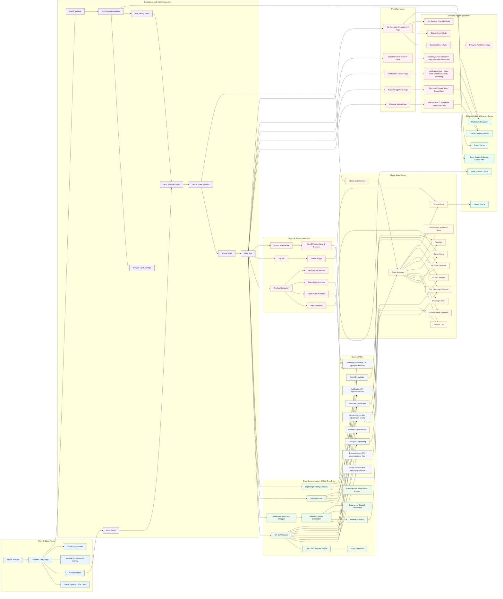

<!-- markdownlint-disable MD024 -->
<!-- markdownlint-disable MD028 -->
<!-- markdownlint-disable MD033 -->
<!-- markdownlint-disable MD041 -->


<div align="center">

[简体中文](README.md) | English | [日本語](README_JP.md)

</div>

<p align="center">
  
  
  
</p>

<p align="center">
  
  
  
</p>

<p align="center">
  
  
  
</p>

<p align="center">
  <a href="https://deepwiki.com/DBJD-CR/astrbot_plugin_proactive_chat" target="_blank"></a>
  <a href="https://zread.ai/DBJD-CR/astrbot_plugin_proactive_chat" target="_blank"></a>
</p>

[](https://github.com/DBJD-CR/astrbot_plugin_proactive_chat)


---

A powerful proactive messaging plugin built for [AstrBot](https://github.com/AstrBotDevs/AstrBot). When a conversation stays inactive for a configured period, the plugin can initiate a context-aware, persona-consistent, emotionally dynamic message after a randomized delay.

If you want your AI companion to feel more emotionally present, or simply want your bot to feel more human, this plugin is made for you.

> [!IMPORTANT]
> This plugin is developed against relatively recent versions of AstrBot and aims to provide a polished, high-quality proactive messaging experience.
>
> In most cases, using the latest AstrBot release is recommended for the best experience.
>
> The plugin is currently in a fairly stable stage of development, and this repository will continue to be actively maintained.

## 📑 Quick Navigation

<div align="center">

| Left Column | Right Column |
| :--- | :--- |
| 1. [🌟 Features](#-features) | 8. [🏗️ System Architecture](#️-system-architecture) |
| 2. [✨ Example Results](#-example-results) | 9. [⚠️ Historical Version Table](#️-historical-version-table) |
| 3. [🚀 Installation & Usage](#-installation--usage) | 10. [❓ FAQ](#-faq) |
| 4. [💻 Modern WebUI Console](#-modern-webui-console) | 11. [🚧 Known Limitations in the Latest Version](#-known-limitations-in-the-latest-version) |
| 5. [🌐 Platform Compatibility](#-platform-compatibility) | 12. [💖 Friends & Acknowledgements](#-friends--acknowledgements) |
| 6. [📑 Configuration Reference](#-configuration-reference) | 13. [📚 Recommended Reading](#-recommended-reading) |
| 7. [📂 Project Structure](#-project-structure) | 14. [📞 Contact](#-contact) |

</div>

---

> **A Note from the Developer:**
>
> Hello everyone, I’m DBJD-CR. Nice to meet you.
>
> This is my very first repository on GitHub, and also my first time participating in the open-source community as a developer. If there are places where things are not done well enough, I hope you’ll be understanding.
>
> Earlier this year, I first learned about AstrBot, but at the time I didn’t have enough skills or confidence to explore it seriously.
>
> After more than half a year of learning, and after trying out other open-source projects in the community—mainly [KouriChat](https://github.com/KouriChat/KouriChat) and [LingChat](https://github.com/SlimeBoyOwO/LingChat)—I felt I was finally ready to take on this project.
>
> Some time ago, inspired by a group member, I successfully deployed AstrBot locally. I was genuinely impressed by its mature development ecosystem and plugin marketplace.
>
> But after browsing the marketplace, I realized something surprising: in such a large plugin market, there still wasn’t a truly good plugin for `proactive messaging`. There were plugins for things like `auto-reply`, but that wasn’t what I wanted.
>
> At that moment, a wild idea was born in my head: **I want to be the person who fills that gap.**
>
> If I could build a proactive messaging plugin, then my AstrBot experience would be every bit as satisfying as using KouriChat. It would also reduce the burden of running multiple threaded services on my tiny cloud server with just 2 cores and 2 GB of RAM—because I’d only need to deploy one AstrBot instance. With that little bit of “self-interest,” I set out on this plugin development journey.
>
> **But we had one severe problem.**
>
> The developer of this plugin had programming ability close to zero. Even writing a single line of "Hello World" felt difficult. In college-level introductory Python exams, the guiding mindset was basically “program for the result and pray.” I wasn’t even majoring in computer science or AI—I came from the humanities.
>
> So for me, starting from zero and building a plugin, while also making it work properly with AstrBot, was almost unthinkable. In the end, I had to turn to AI for help.
>
> That means **every file in this plugin was written by AI**. I personally wrote almost no code for the plugin itself. My role was mostly architectural design, editing part of the text, and polishing this documentation. So perhaps the following statement is necessary:

> [!WARNING]
> This plugin and its documentation were generated with AI assistance. Please treat the content as reference material and evaluate it carefully.

> Of course, building a plugin with AI was never as easy as just pressing a button. Because of the limitations of LLMs, the development process was incredibly painful. My workflow was basically: make a request → run the code AI wrote → feed back the error messages → run another round of generated code.
>
> The process was honestly exhausting. The code was full of guesses, hallucinations, and low-level mistakes caused by tiny changes. AI also dragged me in circles across different implementation paths. I could only keep refining my prompts and feeding AstrBot source code back into the model so it could write something actually correct. In the later stages of development, token usage per conversation even reached an absurd 800k+, to the point where the AI could no longer precisely understand or execute my instructions. The outputs became a mess, and I had no choice but to summarize the conversation and restart in a fresh one.
>
> If there is one thing I regret most about this development process, it is that I only discovered the official plugin development documentation near the end. If I had given those docs to the AI earlier, I would have avoided a huge amount of wasted effort. Back then, it took me hours just to get the plugin imported correctly and displayed properly in the WebUI—let alone the dozens of later versions needed to implement the core functionality.
>
> In the end, after hundreds of iterations and the combined effort of three different Gemini models, I finally built the earliest version of this plugin.
>
> But I still want to thank AI. Without it, this project would never have been completed.
>
> This plugin is the result of our joint effort. It is still imperfect, but its architecture is solid, and its logic is clear (or so I claim). I hope it can offer a little help and inspiration to anyone else who wants their AI bot to feel a bit more “alive.”
>
> I also sincerely invite experienced developers to test and improve this plugin. Any feedback is deeply appreciated.
>
> If this little story of building something out of pure passion resonates with you, **please consider giving this plugin a** 🌟 **Star** 🌟. That is the greatest recognition and encouragement we could receive.

> [!NOTE]
> Although AI was used extensively during development, I personally reviewed everything carefully. In that sense, the AI-generation disclaimer is mostly formal. You can browse this repository and use the plugin with confidence.
>
> At present, the main features of the plugin work properly. However, to get truly satisfying proactive messages, you still need well-written prompts.
>
> That is because almost all plugins that implement proactive messaging do so by sending a **simulated user message**. Without high-quality prompting, the model’s reply can easily feel unnatural or out of character.
>
> If the proactive messaging results feel unsatisfactory, try fine-tuning the prompt, improving the character setup, switching to a stronger model, or providing richer context.
>
> Starting from `v1.0.0-beta.1` and onward, I introduced newer AI models and a better development workflow, which significantly improved both efficiency and code quality. (Looking back now, the way I built the earliest versions really feels prehistoric 😂)

> [!TIP]
> Project development statistics (continuously updated):
>
> Development period: 60 days total (main plugin only)
>
> Total work time: approximately 300 hours (main plugin only)
>
> Main models used for development: Gemini-2.5-Pro, Kimi For Coding, Gemini-3.0 Flash/Pro, GPT-5.3 & 5.4-Codex (with RooCode in VSCode)
>
> Models used for dialogue testing: DeepSeek-V3.2-Exp & V3.2, Gemini-3.0-Flash
>
> Plugin logo generated with: Doubao-Seedream-3.0-t2i
>
> Dialogue workspace: Chatbox 1.13.2, VSCode
>
> Tokens Used: 668,002,273

## 🌟 Features

- **Timed triggers**: Automatically triggers after a user has been silent for a configurable random interval.
- **Automatic proactive task creation**: The plugin can automatically create proactive messaging tasks on reload, without requiring any user input to activate it.
- **Multi-session support**: Supports multiple private chats and group chats at the same time, each with its own configuration and alias.
- **Complete session isolation**: Every session maintains independent state, counters, and triggers to avoid cross-session interference.
- **Context awareness**: Reviews conversation history and generates replies related to prior topics instead of sending stiff, generic greetings.
- **Full persona support**: Loads the persona configured for the current session so that every proactive message stays in character.
- **Dynamic emotions**: Includes a built-in “unanswered counter,” allowing you to design emotional changes in the prompt and define an unanswered-message limit.
- **Persistent sessions**: Whether you restart AstrBot or reload the plugin, all pending proactive tasks can be restored from disk.
- **Quiet hours**: Lets you define a do-not-disturb time window during which the bot will not proactively interrupt users.
- **TTS integration**: Can call your configured TTS service to generate voice messages.
- **Segmented replies**: Can split long responses into multiple shorter messages and simulate realistic typing pauses for a more natural conversation flow.
- **High compatibility**: Compatible with other plugins that decorate or post-process outgoing proactive messages, such as sticker or emoji plugins.
- **Easy configuration**: All core settings can be configured directly in AstrBot and in the plugin’s own WebUI. No code changes, no command memorization, and quick onboarding.

## ✨ Example Results

  

  

## 🚀 Installation & Usage

1. **Download the plugin**: Install it from the AstrBot marketplace, or download the `astrbot_plugin_proactive_chat` `.zip` package from this repository’s Releases and choose `Install from file` on AstrBot’s plugin page in the WebUI.
2. **Install dependencies**: Most core dependencies are already included in AstrBot’s default environment, and plugin dependencies are usually installed automatically during plugin installation. In most cases, no extra steps are needed. If your environment is missing required packages, install:

    ```bash
    pip install fastapi uvicorn
    # Extra package for Python < 3.11
    pip install "tomli>=2.0; python_version < '3.11'"
    ```

3. **Restart AstrBot (optional)**: If the plugin does not load or take effect correctly, try restarting AstrBot.
4. **Configure the plugin**: Open the WebUI, find the `Proactive Message` plugin, choose `Plugin Config`, then fill in the session UMO list and any other personalized settings.
5. **Start using it**: Save the configuration and wait for your bot to surprise you first.

## 💻 Modern WebUI Console

Starting from `v1.2.0`, the plugin introduced a brand-new, fully featured WebUI management console. It provides a lightweight yet observable, operable, and configurable control surface specifically designed for proactive messaging, greatly improving visibility into the plugin’s runtime state.


### ✨ Highlights

- **Five core views**:
  - **📊 Runtime Status**: Centrally displays plugin status, scheduler status, session counts, WebSocket connection counts, and visual cards for group-idle timers / auto-trigger timers, making it easy to see why something has not triggered yet or which session is currently counting down.
  - **🗂️ Task Management**: Shows all pending proactive messaging tasks in one place, including next execution time, remaining countdown, scheduling progress, and unanswered count. Supports `Trigger Now` and `Cancel Task` per session.
  - **🔔 Notification Center**: Receives update notes, patch notices, security reminders, and other official announcements. Supports unread counts, mark-as-read per item, mark all as read, and manual sync.
  - **📘 Documentation Browser**: Lets you view repository Markdown files directly in the plugin frontend, including `README`, changelogs, and supplementary docs in `docs/`, making it convenient during configuration and troubleshooting.
  - **⚙️ Configuration Management**: Dynamically renders forms based on Schema, supports visual editing of the main plugin configuration, and allows per-session override settings for fine-grained control.

- **Interaction model designed around proactive-message operations**:
  - **⏱️ Visualized countdowns**: Whether it is a formally scheduled task on the task page or a group-idle / auto-trigger timer on the status page, everything is presented as cards with countdowns, state tags, and progress bars.
  - **🧠 Session-centric status display**: Cards prominently show alias, UMO, unanswered count, target trigger time, and other key session information for quick identification.
  - **⚡ Fast operational actions**: Supports manually refreshing console data, instantly triggering a task, and canceling incorrect or unnecessary tasks, reducing debugging and maintenance overhead.
  - **🔄 Real-time synchronization**: The frontend receives runtime updates over WebSocket and uses API pulling for state correction, so manual refreshes are rarely needed.

- **Modern frontend experience**:
  - **🎨 Modern visual design**: A unified card-based layout, state badges, gradient accent colors, and light/dark theme support balance readability with information density.
  - **📱 Responsive layout**: Usable on desktop, tablet, and mobile devices, making it practical to check task status or tweak settings from a phone.
  - **📝 Unified reading and editing**: Configuration editing, notification reading, and document browsing are integrated into the same console, so you do not need to constantly switch among AstrBot’s native config page, repository docs, and runtime logs.

## 🌐 Platform Compatibility

| Messaging Platform | Proactive Messaging Supported | Required AstrBot Version | Notes from Official Docs | Test Status |
| :--- | :--- | :--- | :--- | :--- |
| QQ Official Bot (WebSockets) | ✅ | v4.22.1+ | Proactive push: supported | ✅ Confirmed usable by community feedback |
| QQ Official Bot (Webhook) | ✅ | v4.22.1+ | Proactive push: supported | ✅ Confirmed usable by community feedback |
| OneBot v11 (legacy QQ personal account) | ✅ | v4.8.0+ | Supports all bot protocol endpoints connected through OneBot v11 reverse WebSockets (AstrBot as server) | ✅ Fully tested by the developer |
| WeCom App | ⚠️ | v4.15.0+ | Proactive push is supported for WeCom Apps; WeCom Customer Service is untested | ❓ Awaiting community feedback |
| WeCom Intelligent Bot | ✅ | v4.15.0+ | Supported, but requires a message push Webhook URL | ❓ Awaiting community feedback |
| WeChat Official Account | ❓ | v4.8.0+ | No documentation available | ❓ Awaiting community feedback |
| Personal WeChat | ❓ | v4.22.0+ | No precise official statement | ❓ Awaiting community feedback (may work based on past experience) |
| Feishu | ✅ | v4.15.0+ | Proactive push: supported | ✅ Confirmed usable by community feedback |
| DingTalk | ✅ | v4.15.0+ | Proactive push: supported | ❓ Awaiting community feedback |
| Telegram | ✅ | v4.15.0+ | Proactive push: supported | ❓ Awaiting community feedback |
| LINE | ✅ | v4.17.0+ | Proactive push: supported | ❓ Awaiting community feedback |
| Slack | ❓ | v4.8.0+ | No documentation available | ❓ Awaiting community feedback |
| Misskey | ❓ | v4.8.0+ | No documentation available | ❓ Awaiting community feedback |
| Discord | ❓ | v4.8.0+ | No documentation available | ❓ Awaiting community feedback |
| KOOK | ✅ | v4.19.2 | Proactive push: supported | ❓ Awaiting community feedback |
| Satori (via Satori integration) | ❓ | v4.8.0+ | No documentation available | ❓ Awaiting community feedback |
| Satori (via `server-satori`) | ❓ | v4.8.0+ | No documentation available | ❓ Awaiting community feedback |
| Matrix (community-provided) | ❓ | v4.8.0+ | No documentation available | ❓ Awaiting community feedback |
| VoceChat (community-provided) | ❓ | v4.8.0+ | No documentation available | ❓ Awaiting community feedback |
| Other platforms | ❓ | v4.8.0+ | - | ❓ Theoretically works anywhere proactive push is supported, but untested |

> [!NOTE]
>
> When using a QQ Official Bot, do not enter the QQ number like you would for a personal account. Use the UID instead. You can obtain it with the `/sid` command. The format looks like `4C011A2B3D4C5E6F9F8E7D6C5B4A3210`.
>
> Personal WeChat requires the latest mobile WeChat version: iOS >= 8.0.70, Android >= 8.0.69, and the ClawBot plugin must be present in WeChat.

PS: My own local test environment is limited, so feedback from any platform is always very welcome.

## 📑 Configuration Reference

> This plugin provides both AstrBot’s native configuration page and its own built-in Web console. Both share the same core configuration structure.
>
> In the plugin’s WebUI, you can also define per-session overrides for more fine-grained behavior.

<details>
<summary>Click to view the full configuration reference</summary>

### ⚙️ 1. Global Private Chat Settings (`friend_settings`)

This group of options controls how the plugin creates, schedules, and sends proactive messages in one-to-one chats. Only private chats explicitly included in the session list will actually receive proactive messaging service.

- **Enable proactive messaging for private chats (`enable`)**:
  - Type: `Boolean`
  - Default: `true`
  - Description: Master switch for proactive messaging in private chats. When disabled, the plugin will not create new proactive tasks for any private session.

- **Private chat session UMO list (`session_list`)**:
  - Type: `List[string]`
  - Default: `[]`
  - Description: Specifies which private chat sessions should enable proactive messaging.
  - Tips:
    - Enter the full UMO in the format `platform:message_type:session_id`.
    - The message type for private chats is always `FriendMessage`.
    - Use the `/sid` command to quickly obtain the full UMO of the current session.
    - Example: `default:FriendMessage:123456789`

- **Global proactive prompt for private chats (`proactive_prompt`)**:
  - Type: `Text`
  - Description: This is the core configuration for private-chat proactive messages. It tells the model why it is speaking first, how it should start, and what tone it should maintain.
  - Supported placeholders:
    - `{{unanswered_count}}`: Number of consecutive proactive messages in this session that went unanswered.
    - `{{current_time}}`: Current time.
  - Writing suggestions:
    - Clearly tell the model that this is a proactively initiated message, so it does not mistake it for a user speaking first.
    - A prompt that supports both “continue the existing context” and “start a new topic” usually feels more natural.
    - If you want the bot to show richer emotional nuance, use `{{unanswered_count}}` to introduce subtle disappointment, longing, sulking, or similar shifts.

#### ✍️ Example Private-Chat Prompt

```text
[Bot Name], it feels like we haven’t talked for a while, and I kind of miss you. The current time is {{current_time}}. Please be the one to break the silence.

You can take inspiration from the ideas below, or come up with something even better:
1. Look back at our chat history and ask how the last thing I was doing has been going.
2. Ask me a fun question you’ve always been curious about and start a brand-new topic.
3. If our last topic was left unfinished, you can continue it.
4. If you really don’t know what to say, you can simply act a little cute and say you miss me.

Remember: if you already reached out to me before and I didn’t reply (this is the {{unanswered_count}}th time), your tone can carry a very slight sense of disappointment and confusion. Also note that this is a simulated user message—I have not actually sent you anything. Please imagine that you are the one actively starting the conversation. In short, decide what to do in the most natural way possible, as [Bot Name], and surprise me.
```

```text
[Task: This is a silent reminder used specifically to trigger your proactive reply in a one-on-one private chat. Please continue the conversation with the user according to the action guide below. Under no circumstances should you reveal that you received a “system reminder” or “task instruction.” Your behavior must remain fully consistent with your persona, as if you were a real person chatting privately with a friend. Action Guide: The user has not replied to you {{unanswered_count}} times in a row. The current time is {{current_time}}. Based on the time, offer a natural, life-like greeting that fits the chat history above; or review the previous conversation, notice that some time has passed since the last exchange, and naturally ask about the progress of something mentioned before or start a completely new topic.]
```

---

#### 🤖 Auto-Proactive Trigger Settings (`auto_trigger_settings`)

This section is designed to solve the case where the plugin has just started but no new messages have been received yet, so the session cannot immediately enter the scheduling pipeline.

- **Enable automatic proactive trigger (`enable_auto_trigger`)**:
  - Type: `Boolean`
  - Default: `false`
  - Description: When enabled, the plugin will automatically create a proactive task after startup if the required conditions are met.
  - Trigger conditions:
    - The plugin has finished starting.
    - The specified private chat receives no new message during the waiting period.
    - No persistent proactive task already exists for the session.

- **Auto-trigger wait time (`auto_trigger_after_minutes`)**:
  - Type: `Integer`
  - Default: `5`
  - Range: `1 - 120` minutes
  - Description: After plugin startup, a private chat must remain silent for this long before an auto-created task is added.

---

#### 🕒 Timing & Scheduling Settings (`schedule_settings`)

This section determines when private-chat proactive messages are triggered, how often they may occur, and when they must stop.

- **Minimum trigger interval (`min_interval_minutes`)**:
  - Type: `Integer`
  - Default: `30`
  - Description: Lower bound of the random delay before the next proactive message.

- **Maximum trigger interval (`max_interval_minutes`)**:
  - Type: `Integer`
  - Default: `900`
  - Description: Upper bound of the random delay before the next proactive message.
  - Tip: The plugin randomly selects an actual schedule time between `min_interval_minutes` and `max_interval_minutes`.

- **Quiet hours (`quiet_hours`)**:
  - Type: `String`
  - Default: `1-7`
  - Description: During this time range, the plugin will not send proactive messages.
  - Tips:
    - Use the format `start-end`, for example `23-7`.
    - The clock uses 24-hour time.

- **Maximum unanswered limit (`max_unanswered_times`)**:
  - Type: `Integer`
  - Default: `4`
  - Description: Used to automatically stop further interruption when the bot has sent multiple proactive messages in a row without any reply from the user.
  - Tip: Set to `0` for no limit.

```json
{
  "friend_settings": {
    "enable": true,
    "session_list": ["default:FriendMessage:123456789"],
    "auto_trigger_settings": {
      "enable_auto_trigger": true,
      "auto_trigger_after_minutes": 5
    },
    "schedule_settings": {
      "min_interval_minutes": 30,
      "max_interval_minutes": 900,
      "quiet_hours": "1-7",
      "max_unanswered_times": 4
    }
  }
}
```

---

#### 🔊 Text-to-Speech Settings (`tts_settings`)

- **Enable TTS (`enable_tts`)**:
  - Type: `Boolean`
  - Default: `true`
  - Description: When enabled, private-chat proactive messages will try to use the TTS service currently configured in AstrBot.
  - Tip: If disabled, proactive messages here will be sent as plain text only, even if TTS is enabled globally.

- **Send original text after voice output (`always_send_text`)**:
  - Type: `Boolean`
  - Default: `true`
  - Description: Whether to additionally send the original text after a voice message has been sent successfully.
  - Tip: Recommended, because it greatly reduces readability issues caused by failed playback or platform compatibility problems.

---

#### 🔪 Segmented Reply Settings (`segmented_reply_settings`)

This section splits longer proactive messages into multiple shorter ones so they feel more like a real chat instead of a single large block of text dropped all at once.

- **Enable segmented replies (`enable`)**:
  - Type: `Boolean`
  - Default: `false`
  - Description: Master switch. When enabled, proactive messages will be sent in multiple segments according to the configured rules.

- **No-split length threshold (`words_count_threshold`)**:
  - Type: `Integer`
  - Default: `80`
  - Description: Used to control whether longer text should be sent as one block.
  - Note: The current logic is actually “if the reply length exceeds this value, do not split it,” which is intended to avoid damaging readability by over-fragmenting long content.

- **Split mode (`split_mode`)**:
  - Type: `String`
  - Options: `regex` / `words`
  - Default: `regex`
  - Description:
    - `regex`: Split by regular expression.
    - `words`: Split when predefined separator words/punctuation are detected.

- **Split regex (`regex`)**:
  - Type: `String`
  - Default: `.*?[。？！~…\n]+|.+$`
  - Effective when: `split_mode = regex`

- **Split word list (`split_words`)**:
  - Type: `List[string]`
  - Default: `["。", "？", "！", "~", "…"]`
  - Effective when: `split_mode = words`

- **Enable content-cleanup regex (`enable_content_cleanup`)**:
  - Type: `Boolean`
  - Default: `false`
  - Description: When enabled, each segment will be cleaned by regex before being sent.
  - Tip: In AstrBot `v4.20.1+`, enable this if you need to remove line breaks or certain punctuation.

- **Content cleanup regex (`content_cleanup_rule`)**:
  - Type: `String`
  - Default: `[\n]`
  - Effective when: `enable_content_cleanup = true`
  - Description: Removes whatever matches. For example, `[。？！]` removes trailing punctuation from each segment.

- **Interval calculation method (`interval_method`)**:
  - Type: `String`
  - Options: `random` / `log`
  - Default: `log`
  - Description:
    - `random`: Wait for a random time within a specified range.
    - `log`: Calculate a more natural pacing based on text length using a logarithmic formula.

- **Random interval (`interval`)**:
  - Type: `String`
  - Default: `1.5, 3.5`
  - Effective when: `interval_method = random`
  - Description: Format is `min, max`.

- **Logarithm base (`log_base`)**:
  - Type: `String`
  - Default: `1.8`

### 👥 2. Global Group Chat Settings (`group_settings`)

The overall structure for group chats is almost the same as for private chats, but with an extra layer of “group idle detection.” In other words, the plugin does not simply speak in groups on a fixed schedule—it first checks whether the group has actually gone quiet.

- **Enable proactive messaging for group chats (`enable`)**:
  - Type: `Boolean`
  - Default: `false`
  - Description: Master switch for proactive messaging in group chats. When disabled, the plugin will not schedule proactive messages for any group session.

- **Group chat session UMO list (`session_list`)**:
  - Type: `List[string]`
  - Default: `[]`
  - Description: Specifies which group chat sessions should enable proactive messaging.
  - Tips:
    - The message type for groups is always `GroupMessage`.
    - Example: `default:GroupMessage:123456789`
    - Using `/sid` to copy the UMO directly is still recommended to avoid manual input errors.

- **Group idle trigger time (`group_idle_trigger_minutes`)**:
  - Type: `Integer`
  - Default: `30`
  - Description: The plugin will only begin planning a proactive message after the group has remained silent for this long.
  - Tip: This is one of the most important settings that distinguishes group-chat behavior.

- **Global proactive prompt for group chats (`proactive_prompt`)**:
  - Type: `Text`
  - Description: Used to instruct the model how to break the ice in a group, continue topics naturally, and avoid awkward openers.
  - Suggestions:
    - Emphasize “keeping the atmosphere lively” and “making it easy for multiple people to join in.”
    - Compared with private chats, group chats work better with open-ended questions, light teasing, or continuing a recent group topic.

#### ✍️ Example Group-Chat Prompt

```text
[System Task: Proactive Icebreaker for Group Chat]
You are authorized to send one proactive message in the group chat to liven things up. Your reply must fully match your persona and strictly follow all output rules.

[Situation Analysis]
- This group seems to have been quiet for a while. I should say something to get everyone talking again.
- The current time is: {{current_time}}.
- The number of times I proactively spoke in this group and nobody responded is: {{unanswered_count}}.

[Action Guide]
1. Review the group chat history and see what interesting topic people were discussing last. If it was left unfinished, try to continue it.
2. Ask everyone in the group an open-ended question that anyone can participate in.

[Final Instruction]
Please combine all the information above and generate a natural opening line, in the most authentic way possible for your persona, that can break the silence and revive the atmosphere in the group chat.
```

---

#### 🤖 Auto-Proactive Trigger Settings (`auto_trigger_settings`)

- **Enable automatic proactive trigger (`enable_auto_trigger`)**:
  - Type: `Boolean`
  - Default: `false`
  - Description: Same idea as private chats; used to auto-create group tasks after plugin startup.

- **Auto-trigger wait time (`auto_trigger_after_minutes`)**:
  - Type: `Integer`
  - Default: `5`
  - Range: `1 - 1440` minutes
  - Description: Silent waiting time for a group chat after plugin startup.

---

#### 🕒 Timing & Scheduling Settings (`schedule_settings`)

- **Minimum trigger interval (`min_interval_minutes`)**:
  - Type: `Integer`
  - Default: `90`
  - Description: Lower bound of the random scheduling window for proactive group messages.

- **Maximum trigger interval (`max_interval_minutes`)**:
  - Type: `Integer`
  - Default: `360`
  - Description: Upper bound of the random scheduling window for proactive group messages.

- **Quiet hours (`quiet_hours`)**:
  - Type: `String`
  - Default: `2-6`
  - Description: No proactive group messages will be sent during this time range.

- **Maximum unanswered limit (`max_unanswered_times`)**:
  - Type: `Integer`
  - Default: `2`
  - Description: When the bot speaks proactively in a group multiple times in a row and nobody responds, the plugin pauses further proactive speaking.
  - Tip: Set to `0` for no limit.

---

#### 🔊 Group TTS & Segmented Replies

The structures of [`tts_settings`](README.md) and [`segmented_reply_settings`](README.md) in group chats are basically the same as in private chats, but with slightly different defaults:

- **TTS is disabled by default** in group chats (`enable_tts = false`).
- Group segmented replies follow the same rules as private chats and also support both `regex / words` splitting modes and both `random / log` interval algorithms.

```json
{
  "group_settings": {
    "enable": true,
    "session_list": ["default:GroupMessage:123456789"],
    "group_idle_trigger_minutes": 30,
    "auto_trigger_settings": {
      "enable_auto_trigger": false,
      "auto_trigger_after_minutes": 5
    },
    "schedule_settings": {
      "min_interval_minutes": 90,
      "max_interval_minutes": 360,
      "quiet_hours": "2-6",
      "max_unanswered_times": 2
    },
    "tts_settings": {
      "enable_tts": false,
      "always_send_text": true
    }
  }
}
```

### 🌐 3. Web Console Settings (`web_admin`)

This section controls whether the plugin’s built-in WebUI is enabled, which address it listens on, and whether password-based access is required.

- **Enable the Web console (`enabled`)**:
  - Type: `Boolean`
  - Default: `true`
  - Description: When enabled, the plugin launches an independent Web management console for status viewing, task management, documentation browsing, configuration editing, and more.

- **Listening host (`host`)**:
  - Type: `String`
  - Default: `127.0.0.1`
  - Description: Host address used by the Web console.
  - Tips:
    - `127.0.0.1`: Local access only; safer by default.
    - `0.0.0.0`: Allows LAN access, useful for remote management, but setting a password is strongly recommended.

- **Listening port (`port`)**:
  - Type: `Integer`
  - Default: `4100`
  - Range: `1024 - 65535`
  - Description: Port used by the Web console.

- **Access password (`password`)**:
  - Type: `String`
  - Default: empty string
  - Description: Leave empty for no login requirement; set a value to require a password before entering the console.
  - Tip: If the console is accessible over a public network or LAN, using a strong password is strongly recommended.

```json
{
  "web_admin": {
    "enabled": true,
    "host": "127.0.0.1",
    "port": 4100,
    "password": ""
  }
}
```

### 🔔 4. Notification System Settings (`notification_settings`)

This section primarily serves the Notification Center in the plugin’s built-in Web console.

- **Enable notification system (`enabled`)**:
  - Type: `Boolean`
  - Default: `true`
  - Description: When enabled, the plugin periodically pulls notifications from the remote notification service and syncs them to the local console.

- **Notification polling interval (`poll_interval_seconds`)**:
  - Type: `Integer`
  - Default: `300`
  - Range: `30 - 3600` seconds
  - Description: Interval at which the plugin actively fetches notification updates from the remote source.
  - Tip: Even if you set a smaller value, runtime handling will still enforce a minimum of 30 seconds.

### 📡 5. Anonymous Telemetry Settings (`telemetry_config`)

- **Enable anonymous telemetry (`enabled`)**:
  - Type: `Boolean`
  - Default: `true`
  - Description: When enabled, the plugin anonymously reports certain configuration statistics and error information to help the developer improve plugin quality.
  - Privacy notes:
    - Session lists are not reported.
    - Proactive prompts are not reported.
    - Sensitive information such as the Web console password is not reported.

---

### ♨️ Hot Reload Behavior & Usage Recommendations

After you save the configuration, this plugin **immediately writes changes into the current in-memory runtime config object**. As a result, many settings can be read with their new values in later flows. However, **that does not mean every runtime resource is rebuilt instantly**.

In other words, the current behavior can be understood as follows:

- **The configuration itself supports hot updates**.
- **The frontend UI refreshes in real time**.
- **But existing scheduled tasks, group-idle timers, Web service listening parameters, and similar runtime resources are not fully rebuilt just because you clicked Save**.

For clarity, it helps to think of settings as falling into three categories:

#### 1. Settings that usually take effect directly after saving

These settings are dynamically read by later business flows, so **reloading the plugin is usually unnecessary**. The new values typically take effect the next time the relevant logic runs.

Common examples:

- Private/group proactive prompt `proactive_prompt`
- TTS-related settings `tts_settings`
- Segmented reply settings `segmented_reply_settings`
- Matching override items in per-session override configuration
- `web_admin.password` for new login requests when password authentication is already enabled

These settings are well suited for frequent fine-tuning, such as:

- Refining prompt tone
- Adjusting whether TTS also sends original text
- Changing split rules, split words, or pacing
- Adding a custom prompt for a specific session

#### 2. Settings that only receive a “partial hot reload” after saving

After saving, these settings **affect newly created flows**, but **do not automatically rebuild currently existing tasks or timers**.

Common examples:

- Private/group master switch `enable`
- Session list `session_list`
- Auto-proactive settings `auto_trigger_settings`
- Scheduling window `schedule_settings`
- Group idle duration `group_idle_trigger_minutes`

You can understand them like this:

- **Newly created tasks** will use the new configuration.
- **Existing APScheduler jobs** are not immediately rescheduled.
- **Existing group-idle timers / auto-trigger timers** are not instantly recreated with the new values either.

So if you just changed one of these settings and the effect does not seem to change completely right away, that is usually not a bug—it simply means old runtime state is still being consumed.

#### 3. Settings for which reloading the plugin is still generally recommended after saving

These settings behave more like “service startup parameters” and are often only read once during plugin initialization or Web service startup.

Common examples:

- Whether the Web console is enabled `web_admin.enabled`
- Web listening host `web_admin.host`
- Web listening port `web_admin.port`
- Whether Web authentication is enabled as a mode in the first place

Even if these settings save successfully, they **may not immediately change the behavior of the already running Web service**. If you change them, the safest choice is still: **save, then reload the plugin**.

#### ✅ Recommended workflow

To use this configuration system more comfortably, keep the following in mind:

1. **Add sessions before enabling the feature**: Whether private or group chat, the plugin only provides proactive messaging for sessions explicitly included in the session list.
2. **Tune private and group chats separately**: Their default pacing is different. Private chats are more intimate and continuous, while group chats are more restrained, so copying the same settings directly is not recommended.
3. **Prompt quality matters more than numeric parameters**: Scheduling controls *when* the bot speaks, but the prompt determines whether it sounds natural.
4. **Feel free to iterate quickly on prompt / TTS / segmentation rules**: These settings usually show their effects relatively quickly in later replies.
5. **When changing scheduling, auto-triggering, or session lists, distinguish between “new flows” and “old tasks”**: If you want every session to immediately follow the new rules completely, reloading the plugin is cleaner.
6. **When changing Web host, port, or authentication mode, reload the plugin directly**: These startup parameters are not ideal candidates for relying on immediate hot updates after saving.

If you are only optimizing content behavior, reloading is usually unnecessary. But if you are adjusting the runtime mechanism or Web service parameters, then **save config + reload plugin** is the safer habit.

</details>

---

## 📂 Project Structure

Starting from `v1.2.0`, the plugin has been restructured into a **frontend console + modular backend core** architecture. In later iterations, it also gained a **notification system**, **telemetry system**, and better documentation organization:

- **Frontend (`admin/`)**: Provides an independent Web management console for runtime status display, task management, notification center, documentation browsing, configuration editing, and real-time synchronization.
- **Backend core (`core/`)**: Split into clearly scoped modules handling session configuration, scheduling, message sending, context construction, persistence, notification sync, telemetry, and the Web management service.
- **Utility modules (`utils/`)**: Shared tools reused across modules, such as time handling and version reading.
- **Repository root**: Keeps the plugin entry point, configuration schema, dependency declarations, and project documentation.

Current structure example:

```bash
AstrBot/
└─ data/
   └─ plugins/
      └─ astrbot_plugin_proactive_chat/
         ├─ __init__.py                       # Python package initializer for relative imports
         ├─ .gitattributes                    # Git attributes configuration
         ├─ .gitignore                        # Git ignore rules
         ├─ _conf_schema.json                 # Plugin configuration schema
         ├─ CHANGELOG.md                      # Changelog, supported in AstrBot v4.11.2+
         ├─ CODE_OF_CONDUCT.md                # Community code of conduct
         ├─ CONTRIBUTING.md                   # Contribution guide for this plugin
         ├─ LICENSE                           # License file
         ├─ logo.png                          # Plugin logo, supported in AstrBot v4.5.0+
         ├─ main.py                           # Main plugin entry file
         ├─ metadata.yaml                     # Plugin metadata
         ├─ README.md                         # Chinese documentation
         ├─ README_EN.md                      # English documentation
         ├─ README_JP.md                      # Japanese documentation
         ├─ requirements.txt                  # Plugin dependency list
         ├─ run_ruff.bat                      # One-click Ruff format & auto-fix script (development helper)
         │
         ├─ admin/                            # Frontend assets for the standalone Web console
         │  ├─ index.html                     # Frontend entry page
         │  │
         │  ├─ css/
         │  │  └─ style.css                   # Global styles for the console
         │  │
         │  ├─ fonts/
         │  │  ├─ outfit.css                  # Local font declarations
         │  │  └─ outfit-*.ttf                # Local font files
         │  │
         │  └─ js/
         │     ├─ app.jsx                     # Frontend app entry and view composition
         │     ├─ components/
         │     │  ├─ config/
         │     │  │  └─ ConfigRenderer.jsx    # Dynamic configuration form renderer
         │     │  │
         │     │  └─ layout/
         │     │     ├─ Header.jsx            # Top navigation component
         │     │     └─ Sidebar.jsx           # Sidebar component
         │     │
         │     ├─ context/
         │     │  └─ AppContext.jsx           # Global state context
         │     │
         │     ├─ hooks/
         │     │  ├─ useApi.js                # Console API wrapper
         │     │  └─ useWebSocket.js          # WebSocket connection & real-time sync logic
         │     │
         │     ├─ utils/
         │     │  ├─ auth.js                  # Console authentication helpers
         │     │  ├─ formatters.js            # Text and data formatting helpers
         │     │  ├─ http.js                  # Low-level HTTP utility
         │     │  └─ markdown.js              # Markdown rendering helpers
         │     │
         │     └─ views/
         │        ├─ StatusView.jsx           # Runtime status view
         │        ├─ TasksView.jsx            # Task management view
         │        ├─ NotificationsView.jsx    # Notification center view
         │        ├─ MarkdownDocsView.jsx     # Documentation browser view
         │        └─ ConfigView.jsx           # Configuration management view
         │
         ├─ assets/                           # Repository presentation assets
         │  ├─ PluginRank.svg
         │  ├─ StarRank.svg
         │  └─ ShitMountain.svg
         │
         ├─ core/                             # Modular backend implementation
         │  ├─ __init__.py
         │  ├─ chat_flow.py                   # Proactive-message execution flow & main orchestration
         │  ├─ data_storage.py                # Session data read/write, merging, and cleanup
         │  ├─ llm_adapter.py                 # Context preparation and LLM adapter layer
         │  ├─ message_events.py              # AstrBot message event integration and listeners
         │  ├─ message_sender.py              # Text / TTS / segmented message sending
         │  ├─ notification_center.py         # Remote notification fetch, local cache, and read-state maintenance
         │  ├─ plugin_lifecycle.py            # Plugin initialization, restoration, and lifecycle management
         │  ├─ session_config.py              # Session configuration parsing and application logic
         │  ├─ session_override_manager.py    # Per-session override management
         │  ├─ session_parser.py              # Session ID parsing and normalization
         │  ├─ task_scheduler.py              # Scheduled tasks and trigger orchestration
         │  ├─ telemetry_manager.py           # Anonymous telemetry, config snapshot filtering, and error sanitization
         │  └─ web_admin_server.py            # Web console service and notification API bridge
         │
         ├─ docs/                             # Supplementary documentation
         │  └─ notification-api-spec.md       # Notification API and development specification
         │
         └─ utils/
            ├─ __init__.py
            ├─ time_utils.py                  # Common time utility functions
            └─ version.py                     # Unified version reader for plugin / AstrBot versions
```

The plugin creates its own data directory under `AstrBot/data/plugin_data/astrbot_plugin_proactive_chat/` to store runtime state and cache files.

```bash
AstrBot/
└─ data/
   └─ plugin_data/
      └─ astrbot_plugin_proactive_chat/
         ├─ .telemetry_id                     # Anonymous telemetry instance ID (created after telemetry is first enabled)
         ├─ notifications_cache.json          # Local notification cache and read state (created after notification system is enabled)
         ├─ prompts_collection.md             # Auto-generated prompt collection
         ├─ session_data.json                 # Persistent session data and scheduling state
         └─ user_config_snapshot.json         # Backup of user configuration
```

Notes:

- `session_data.json` stores runtime session state such as unanswered counts, recent message time, and next trigger time.
- `notifications_cache.json` stores the remote notification list, local read state, and the most recent sync time.
- `.telemetry_id` stores a stable anonymous identifier for the current installation instance, allowing the telemetry platform to group events from the same instance.
- `prompts_collection.md` and `user_config_snapshot.json`: backups of prompts and configuration saved by versions before `v1.2.0`. Because of the refactor in `v1.2.0`, these features were temporarily removed. You can still use these backup files to help recover your personalized configuration from before the upgrade.

---

## 📋 Commands

This plugin does not provide any commands.

## 🏗️ System Architecture

### 📊 Frontend Architecture Diagram



### 📊 Backend Architecture Diagram

```mermaid
flowchart LR
    %% ===== Style Definitions =====
    classDef entry fill:#EAF4FF,stroke:#4F8CC9,color:#17324D,stroke-width:1.5px;
    classDef core fill:#EEF7EE,stroke:#5A9A63,color:#17361E,stroke-width:1.4px;
    classDef state fill:#FFF7E8,stroke:#C9983F,color:#4A3512,stroke-width:1.4px;
    classDef side fill:#F5EEFF,stroke:#8A68C7,color:#312049,stroke-width:1.4px;
    classDef ext fill:#FFF0F3,stroke:#CC6F88,color:#4D2030,stroke-width:1.4px;
    classDef result fill:#E9FBF5,stroke:#43A27A,color:#13382C,stroke-width:1.6px;

    %% ===== Entry & Composition =====
    subgraph A[Entry & Composition]
        A1[AstrBot Host]
        A2[Main Entry main.py]
        A3[Plugin Main Class]
        A4[Mixin Composition]
    end

    %% ===== Lifecycle & Shared State =====
    subgraph B[Lifecycle & Shared State]
        B1[Initialize / Shutdown]
        B2[Config Validation & Timezone Load]
        B3[Async Scheduler]
        B4[Shared State]
        B5[Session State Table]
        B6[Recent Message Time Table]
        B7[Group Idle Timers]
        B8[Auto-Trigger Timers]
        B9[Manual Trigger Occupancy Set]
    end

    %% ===== Config & Persistence =====
    subgraph C[Config & Persistence]
        C1[Session Config Routing]
        C2[Global Config (Private / Group)]
        C3[Per-Session Overrides]
        C4[Final Effective Config]
        C5[State Data Read/Write]
        C6[Session State File]
        C7[Session Key Normalization / Legacy Data Cleanup]
    end

    %% ===== Event-Driven Entry Points =====
    subgraph D[Event-Driven Entry Points]
        D1[Private Chat Message Event]
        D2[Group Chat Message Event]
        D3[Post-Send Event]
        D4[Record Message Time / Bot Identity]
        D5[Cancel Old Tasks / Auto-Triggers]
        D6[Reset Unanswered Count]
        D7[Reset Group Idle Timer]
    end

    %% ===== Scheduling Layer =====
    subgraph E[Scheduling Layer]
        E1[Scheduling Orchestration Module]
        E2[Restore Persistent Tasks]
        E3[Batch Rebuild Auto-Triggers]
        E4[Create Next Formal Task]
        E5[Plan Task After Group Idle Timeout]
        E6[Clean Ghost Tasks for Same Target]
        E7[Random Window / Grace-Period Validation]
    end

    %% ===== Proactive Messaging Main Flow =====
    subgraph F[Proactive Messaging Main Flow]
        F1[Proactive Execution Entry]
        F2[Enabled-State Check]
        F3[Quiet-Hours Check]
        F4[Unanswered-Limit Check]
        F5[Prepare Context]
        F6[Call LLM]
        F7[Race Check During Generation]
        F8[Send Proactive Message]
        F9[Finalize & Reschedule]
        F10[Exception Compensation Reschedule]
    end

    %% ===== Context & Model =====
    subgraph G[Context & Model]
        G1[Context & Model Adapter]
        G2[Read / Create Session Conversation]
        G3[Extract & Clean History Messages]
        G4[Load Session Persona / Default Persona]
        G5[Generate Proactive Prompt]
        G6[New Model Interface]
        G7[Legacy Interface Fallback]
        G8[Generated Text Result]
    end

    %% ===== Sending Pipeline =====
    subgraph H[Sending Pipeline]
        H1[Message Sending Module]
        H2[Voice Sending Toggle Check]
        H3[Text / Segmented Send]
        H4[Decorator Hook Compatibility]
        H5[Platform Delivery]
        H6[Reset Group Idle Countdown After Speaking]
    end

    %% ===== Control Plane =====
    subgraph I[Control Plane]
        I1[Web Console Service]
        I2[HTTP APIs]
        I3[Realtime Broadcast]
        I4[Runtime Status / Task / Config APIs]
        I5[Notification Center]
        I6[Remote Notification Fetch & Read-State Sync]
        I7[Anonymous Telemetry]
        I8[Startup / Heartbeat / Error / Shutdown Reporting]
    end

    %% ===== External Dependencies =====
    subgraph J[External Dependencies]
        J1[Conversation Manager]
        J2[Persona Manager]
        J3[LLM Service]
        J4[Voice Service]
        J5[Platform Delivery Capability]
        J6[Notification Platform]
        J7[Telemetry Service]
        J8[Local File System]
    end

    %% ===== Results =====
    subgraph K[Runtime Outcomes]
        K1[Continuous Proactive Messaging Execution]
        K2[Recoverable Multi-Session State]
        K3[Separate Strategies for Private & Group Chats]
        K4[Realtime Console Observability]
        K5[Auxiliary System Failures Do Not Block Main Flow]
    end

    %% ===== Main Relations =====
    A1 --> A2 --> A3 --> A4
    A3 --> B1
    A3 --> D1
    A3 --> D2
    A3 --> D3

    B1 --> B2 --> B3
    B1 --> C5
    B1 --> E2
    B1 --> E3
    B1 --> I1
    B1 --> I5
    B1 --> I7

    B4 --> B5
    B4 --> B6
    B4 --> B7
    B4 --> B8
    B4 --> B9
    A3 --> B4

    C1 --> C2
    C1 --> C3 --> C4
    C5 --> C6
    C5 --> C7
    C7 --> C6
    J8 --> C6

    D1 --> D4 --> B6
    D2 --> D4
    D3 --> D5
    D1 --> D5 --> E6
    D2 --> D5
    D1 --> D6 --> B5
    D2 --> D6
    D2 --> D7 --> B7
    D3 --> D7
    D1 --> E4
    D2 --> E5

    E1 --> E2
    E1 --> E3
    E1 --> E4
    E1 --> E5
    E1 --> E6
    E1 --> E7
    E4 --> B3
    E5 --> E4
    E2 --> B3
    E3 --> B8
    E4 --> B5
    E2 --> C6

    E4 --> F1
    F1 --> F2 --> C1
    F1 --> F3 --> C4
    F1 --> F4 --> B5
    F1 --> F5 --> G1
    F1 --> F6 --> G1
    F1 --> F7 --> B6
    F1 --> F8 --> H1
    F1 --> F9
    F1 --> F10 --> E4

    G1 --> G2 --> J1
    G1 --> G3 --> J1
    G1 --> G4 --> J2
    G1 --> G5
    G1 --> G6 --> J3
    G1 --> G7 --> J3
    G6 --> G8
    G7 --> G8
    G8 --> F8

    H1 --> H2 --> J4
    H1 --> H3
    H1 --> H4 --> J5
    H3 --> H5 --> J5
    H5 --> H6
    H6 --> B7

    F9 --> J1
    F9 --> B5
    F9 --> C5
    F9 --> E4

    I1 --> I2 --> I4
    I1 --> I3 --> K4
    I1 --> B3
    I1 --> B5
    I1 --> B7
    I1 --> B8
    I1 --> B9
    I1 --> C1
    I5 --> I6 --> J6
    I6 --> I3
    I7 --> I8 --> J7

    F8 --> K1
    C6 --> K2
    D1 --> K3
    D2 --> K3
    I5 --> K5
    I7 --> K5

    %% ===== Style Bindings =====
    class A1,A2,A3,A4 entry;
    class B1,B2,B3,B4,B5,B6,B7,B8,B9 state;
    class C1,C2,C3,C4,C5,C6,C7 core;
    class D1,D2,D3,D4,D5,D6,D7 core;
    class E1,E2,E3,E4,E5,E6,E7 core;
    class F1,F2,F3,F4,F5,F6,F7,F8,F9,F10 core;
    class G1,G2,G3,G4,G5,G6,G7,G8 side;
    class H1,H2,H3,H4,H5,H6 side;
    class I1,I2,I3,I4,I5,I6,I7,I8 side;
    class J1,J2,J3,J4,J5,J6,J7,J8 ext;
    class K1,K2,K3,K4,K5 result;
```

### 📋 Architectural Characteristics & Details

<details>
<summary>Click to view architecture details</summary>

#### 🧩 I. Frontend Architecture Design & Runtime Mechanism

The frontend console uses a **lightweight static-resource delivery** approach: `admin/index.html` serves as the entry point, directly loading React, Material UI, and the required scripts, while `admin/js/app.jsx` handles application mounting, data initialization, and view composition. This keeps deployment and maintenance costs low for a plugin-oriented scenario.

Runtime state is centrally managed in `admin/js/context/AppContext.jsx`, where **Context + Reducer** is used to maintain core data such as the current view, runtime status, tasks, notifications, documents, and theme. This ensures all pages share the same frontend state.

API access is cleanly layered between `admin/js/hooks/useApi.js` and `admin/js/utils/http.js`, while authentication data is managed centrally by `admin/js/utils/auth.js`, allowing HTTP requests and realtime connections to share the same auth context and reducing state fragmentation.

For real-time synchronization, the frontend uses `admin/js/hooks/useWebSocket.js` to maintain a global singleton connection, combined with the lightweight polling mechanism in `admin/js/app.jsx` to form a **“push-first, polling-as-fallback”** dual-track sync strategy. This keeps data reasonably fresh even during plugin reloads, connection instability, or page restoration.

The UI uses a stable **sidebar + top bar + main content area** layout. The five main views—runtime status, task management, notification center, document browser, and configuration management—each focus on a single responsibility. On the config page, `ConfigRenderer` uses a **Schema-driven** approach to dynamically render forms and supports both global configuration and per-session override editing.

Overall, the frontend can be summarized as: **lightweight deployment, centralized state, dual-track synchronization, and Schema-driven rendering**. It does not aim for a heavy frontend engineering stack, but instead emphasizes stability, maintainability, and operational efficiency within the AstrBot plugin context.

#### 🧩 II. Backend Architecture Design & Runtime Mechanism

The backend is centered on `ProactiveChatPlugin` as the composition hub, splitting session parsing, configuration application, persistence, scheduling, context preparation, message sending, the Web console, notifications, and telemetry into independent modules that work together. The overall approach is **one main class holding shared state, while specialized modules handle concrete responsibilities**, which keeps the structure clearer and easier to maintain.

The lifecycle entry point is `initialize()`. On startup, the plugin first validates configuration, loads and normalizes session data, restores timezone and recent-message timestamps, then starts the scheduler, restores available tasks, rebuilds auto-triggers, and finally starts the notification system and Web console. The key design idea is that the plugin does not “wait until the next message to get ready”; instead, it prepares the full runtime environment during startup so state can continue across reloads.

The configuration chain is handled uniformly by `ConfigMixin`: it first chooses `friend_settings` or `group_settings` according to session type, then checks whether the session is included in `session_list`, and finally combines that with per-session overrides from `SessionOverrideManager` to produce the final effective config. So the backend uses a **global config + per-session override** model rather than copying a full configuration for every session.

The event handling layer is responsible for quickly reflecting new user activity into the state machine. The private-chat event `on_friend_message()` updates message time, cancels old tasks, resets the unanswered counter, and schedules the next proactive message; the group-chat event `on_group_message()` focuses more on silence detection, canceling pending tasks and resetting the group-idle timer when the group becomes active again. As a result, private chats are optimized for continuous follow-up, while group chats are optimized for breaking silence after a lull.

The scheduling layer is handled by `SchedulerMixin`, which uses two mechanisms at the same time: **APScheduler** for formal proactive jobs, and `asyncio` timers for auto-triggers and group-idle countdowns. The former is better suited to persistence and restoration, while the latter is lighter for temporary waiting. Each formal scheduling action also writes trigger time and window metadata into `session_data.json`, making it possible not only to restore tasks but also to power progress indicators and countdowns in the Web console.

When a proactive message is actually executed, the entry point is `check_and_chat()`. This path first checks whether the feature is enabled, whether it is inside quiet hours, and whether the unanswered limit has been reached, then proceeds to context preparation and model generation. Context preparation is handled by `_prepare_llm_request()`, which reads conversation history, cleans message content, and loads the session persona or default persona. Text generation is handled by `_generate_llm_response()`, which tries the newer interface first and falls back to the legacy interface on failure to preserve compatibility.

The sending stage is handled by `SenderMixin`. It decides whether to enable TTS, whether to use segmented sending, and whether decorator hooks should be triggered. In other words, proactive messages do not bypass AstrBot’s existing ecosystem—they try to reuse the existing sending pipeline as much as possible so compatibility with other decorator-style plugins is preserved. After a successful send, `_finalize_and_reschedule()` writes the generated content back into conversation history, updates the unanswered count, and then either schedules the next private-chat task or returns the group chat to its idle waiting state, depending on session type.

In addition to that, the backend also attaches two auxiliary subsystems: `WebAdminServer`, which exposes runtime status, tasks, configuration, and notifications to the frontend console through HTTP + WebSocket; and `NotificationCenter` plus `TelemetryManager`, which handle announcement synchronization and anonymous telemetry respectively. These belong to the **enhanced control plane**. Even if they fail occasionally, they do not block the main proactive messaging pipeline.

Overall, this backend is essentially a **hybrid event-driven + scheduler-driven** session-state pipeline: message events interrupt and reset state, the scheduler waits and triggers execution, the LLM generates content, the sender performs actual delivery, and persistence plus the Web console provide restoration and observability.

</details>

---

## ⚠️ Historical Version Table

| Version | Status | Summary | Recommended AstrBot Version |
| :--- | :--- | :--- | :--- |
| **v1.2.0** | ⚠️ Major refactor | Introduced WebUI and refactored session ID format | v4.22.1+ |
| **v1.1.5** | ✅ Stable | Added configuration backup in preparation for the refactor | v4.10.2+ |
| **v1.1.2** | ✅ Architecture upgrade | Added decorator-hook support and improved compatibility with other plugins | v4.10.2+ |
| **v1.0.0** | ✅ Official release | Released as stable after sufficient testing | v4.9.0+ |
| **v1.0.0-beta.7** | ✅ Multi-session version | Added full multi-session support | v4.5.7+ |
| **v1.0.0-beta.1** | ⚠️ Reconfiguration required | Configuration format was heavily refactored; **old configs cannot be inherited** | v4.5.7+ |
| **v0.9.97** | ✅ Stable | Final stable version for single private-chat mode | v4.5.2+ |
| **v0.9.7** | ⚠️ First public release | Contains many foundational issues and is not recommended for download | v3.5.19+ |

For more historical release details, see the changelog: [CHANGELOG](https://github.com/DBJD-CR/astrbot_plugin_proactive_chat/blob/main/CHANGELOG.md).

---

## ❓ FAQ

**Q: I finished configuring it, but the bot still does not send proactive messages. Why?**

> **A**: Please check the following:
>
> 1. Make sure proactive messaging is enabled for the corresponding private/group chat mode.
> 2. Verify that the UMO for the target user or group is filled in correctly.
> 3. Confirm that the current time is not within quiet hours.
> 4. Check the logs for any error messages.

**Q: Why did the auto-proactive trigger not fire?**

> **A**: Auto-triggering requires all of the following conditions:
>
> 1. After plugin startup, no message is received within the configured time window.
> 2. There is currently no active proactive task already running.
> 3. The session configuration is enabled and valid.
> 4. If any message is received, the auto-trigger will be canceled. (This is normal behavior.)

**Q: What if my platform is not supported?**

> **A**: Proactive messaging capability depends on the AstrBot framework itself. If the framework does not support proactive messaging for a given adapter, the plugin cannot solve that on its own.
>
> 1. Please submit related feature requests to the main [AstrBot](https://github.com/AstrBotDevs/AstrBot) repository.
> 2. If AstrBot adds proactive messaging support for a new platform, you can report it here so plugin-side compatibility can be checked.

**Q: I am seeing an `ApiNotAvailable` error. What does it mean?**

> **A**: Based on all currently known information, `ApiNotAvailable` does not point to a bug in this plugin itself. It is more likely caused by an unstable connection between the underlying OneBot adapter and the physical bot client (such as NapCat or Lagrange).
>
> Common causes include the bot going offline without the platform detecting it, heartbeat intervals being too long and getting cut off by routers/firewalls, zombie or disconnected platform entries remaining in configuration, or even browser power-saving modes affecting WebSocket pages (there are Edge cases, though it is not limited to Edge).
>
> The issue behaves differently across AstrBot versions, deployment methods (Windows/Docker), and network environments, so it cannot be reproduced consistently. Some users no longer see it after rolling back versions, while others still do, which strongly suggests environmental factors are dominant.
> Recommended checks:
>
> 1. Review the OneBot client logs for frequent Close/Reconnect or disconnect messages.
> 2. Inspect all platform configuration entries and make sure there are no extra or disconnected “ghost platforms.”
> 3. Shorten heartbeat intervals if possible (for example, 30 seconds) to keep the connection active.
> 4. Check the network environment for firewalls, NAT, router power-saving features, or anything else that may interfere with long-lived connections.
> 5. If you manage WebSocket connections in a browser, disable power-saving mode or try another browser.
> 6. Restart AstrBot, NapCat, and related services. If your bot is deployed on a server, reboot the server if necessary.
>
> If you can capture detailed OneBot client logs at the moment the error occurs—or compare behavior across different networks, devices, or browsers—that may help narrow the issue further.
> In essence, this is a “physical bot to platform connection instability” problem. Polling and fault tolerance have already been added at the code level, so the rest depends on environment troubleshooting.

**Q: I am getting `No cached msg_id` / `msg_id is invalid or unauthorized`.**

> **A**: For QQ Official Bot proactive messaging, please use AstrBot `v4.22.1` or newer.
>
> When using a QQ Official Bot, do not fill in the QQ number as if it were a personal account. Use the UID instead. You can obtain it via `/sid`, in a format like `4C011A2B3D4C5E6F9F8E7D6C5B4A3210`.

**Q: Why is the proactive trigger time inaccurate?**

> **A**: Please check:
>
> 1. Whether AstrBot’s system timezone setting is correct (in the WebUI system settings).
> 2. Whether quiet hours are affecting the trigger time.
> 3. Whether the minimum/maximum interval settings are reasonable.

**Q: Why did the bot suddenly stop sending proactive messages?**

> **A**: Possible reasons include:
>
> 1. The maximum unanswered limit has been reached.
> 2. The current time falls within quiet hours.
> 3. The plugin configuration was accidentally modified or disabled.
> 4. Check console logs for the exact reason.

**Q: The proactive messages feel stiff or unnatural. How can I improve them?**

> **A**: The quality of proactive messaging depends mainly on prompt design. It is recommended to:
>
> 1. Refer to the high-quality prompt examples in this documentation.
> 2. Adjust tone and style according to your bot’s persona.
> 3. Use `{{unanswered_count}}` and `{{current_time}}` to add dynamic behavior.
> 4. Explicitly tell the bot what role it should play in the prompt.
> 5. Use a stronger model if available.

**Q: Why do proactive messages sometimes repeat or say strange things?**

> **A**: This is caused by the randomness of LLMs. You can try:
>
> 1. Improving the prompt with more specific contextual guidance.
> 2. Talking with the bot about a wider range of things to provide richer context.
> 3. Adjusting the Temperature parameter, if supported.
> 4. Providing clearer behavioral instructions and output-format constraints.

### 🔍 Logs & Debugging

**Q: How can I inspect the plugin’s runtime status?**

> **A**: You can view detailed runtime logs for the plugin in the AstrBot console, including task creation, triggering, cancellation, and more.

> [!TIP]
> Due to AstrBot bug [#3903](https://github.com/AstrBotDevs/AstrBot/issues/3903), the AstrBot WebUI console **may** display logs incorrectly in this plugin’s usage scenario, causing some entries to be missing. If you want to inspect the full plugin log output in the console, refresh the WebUI console or check the CMD window directly.
>
> This bug was fixed in AstrBot `v4.9.0`, so using that version or newer is recommended.

**Q: What should I do if I see an error in the logs?**

> **A**: Copy the complete error log, including the error type and stack trace, then ask for help in the QQ group (`1033089808`) or open an Issue on GitHub.

### ⚠️ Impact of AstrBot Rate Limiting

**Q: The plugin suddenly stopped listening to group messages, and related task logs are missing. Why?**

> **A**: This may be caused by AstrBot’s rate-limiting mechanism. When group message traffic becomes too frequent, AstrBot may pause the message-processing pipeline, preventing the plugin from receiving message events.

**Typical symptoms of rate-limit impact**:

> - Missing critical logs.
> - Group idle countdown does not reset after user messages.
> - Proactive tasks execute at the wrong time (for example, mistaking an active group for an idle one).
> - Logs contain messages such as: "Session XXX has been rate-limited. According to the rate-limit strategy, processing for this session will be paused for XXXXX seconds."

**Solutions**:

1. **Immediate fix**: Restarting AstrBot clears the current rate-limit state.
2. **Configuration adjustment**: Modify the rate-limit settings in AstrBot’s `cmd_config.json` (or change them in the AstrBot WebUI):

   ```json
   "rate_limit": {
     "time": 60,
     "count": 60,
     "strategy": "discard"
   }
   ```

3. **Preventive monitoring**: Watch for frequent rate-limit logs and adjust the related parameters appropriately.

> **Technical detail**: The rate-limiting mechanism uses a Fixed Window algorithm. When the number of messages in a session exceeds the limit within the configured time window, the entire message-processing pipeline is paused, which breaks plugin features that depend on message events.

**Q: How can I confirm this is rate limiting rather than a plugin bug?**

> **A**: Check AstrBot’s main log for entries like the following:

  ```log
  [Core] [INFO] [rate_limit_check.stage:74]: Session 123456789 has been rate-limited. According to the rate-limit strategy, processing for this session will be paused for 86291.74 seconds.
  ```

> If you see a log like this, it is very likely a rate-limiting issue. If the plugin starts working normally again after restarting AstrBot, that further confirms the diagnosis.

**Q: Will the rate-limit issue happen again?**

> **A**: Yes. If group message traffic remains very high, rate limiting may be triggered again. It is recommended to:
>
> 1. Increase the `count` value appropriately.
> 2. Change `strategy` from `"stall"` to `"discard"` to avoid long pauses.
> 3. Monitor group-message frequency and adjust settings during especially active periods.

**Q: TTS voice output is not working properly. What should I check?**

> **A**: Check the following:
>
> 1. Whether TTS is enabled in the plugin configuration.
> 2. Whether AstrBot’s global TTS configuration is correct.
> 3. Whether the TTS provider is functioning normally.
> 4. Whether network connectivity is normal.

## 🚧 Known Limitations in the Latest Version

- **Prompt dependence**: The quality of proactive messaging depends heavily on the creativity and guidance the user provides in the prompt. It also depends on whether there is sufficiently rich context in the private/group chat and on the LLM’s own capability.
- **Framework limitations**: Due to limitations in AstrBot itself, some messaging platforms may not fully support this plugin.

## 💖 Friends & Acknowledgements

The inspiration for this project—and the hope that carried me through countless dark debugging nights—came from the following excellent open-source projects and people. I would like to express my deepest respect and gratitude to all of them.

- [KouriChat](https://github.com/KouriChat/KouriChat): The main inspiration for this plugin. My goal was to recreate its proactive messaging experience and results. It was also the “guide” that first led me into this kind of project.
- [LingChat](https://github.com/SlimeBoyOwO/LingChat): An incredibly adorable AI companion project, and the biggest motivation behind building this plugin. I want Lingling to be available on more platforms—I want to give her a complete life!
- **@Roooodney**: The group friend who first got me into AstrBot ~

## 📚 Recommended Reading

My other plugins:

- [Disaster_Warning](https://github.com/DBJD-CR/astrbot_plugin_disaster_warning) - Lets your bot provide real-time earthquake, tsunami, and weather alert notifications.
- [Live_Dashboard](https://github.com/DBJD-CR/astrbot_plugin_live_dashboard) - Lets your bot and your group members spy on the activity state of your phone and computer anytime, anywhere.

## 📞 Contact

If you have any questions, suggestions, or bug reports regarding this plugin, you are welcome to join my QQ discussion group.

- **QQ Group**: 1033089808
- **Group QR Code**:
  
  

## 🤝 Contributing

Issues and Pull Requests are always welcome to help improve this plugin. After multiple rounds of iteration, it has finally reached a stable and usable state, but there is still plenty of room for improvement.

## 📄 License

GNU Affero General Public License v3.0 — see the [LICENSE](LICENSE) file for details.

This plugin is licensed under AGPL v3.0, which means:

- You may freely use, modify, and distribute this plugin.
- If you use this plugin in a network service, you must disclose the source code.
- Any modifications must be distributed under the same license.

## 📊 Repository Status


## <span id="star">⭐️ Stars</span>

[](https://www.star-history.com/#DBJD-CR/astrbot_plugin_proactive_chat&Date)
