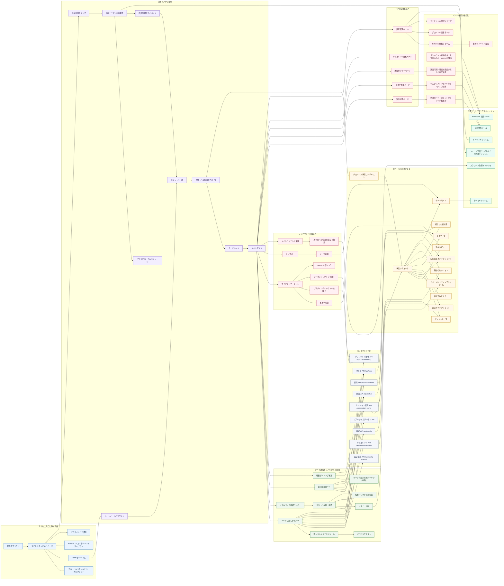
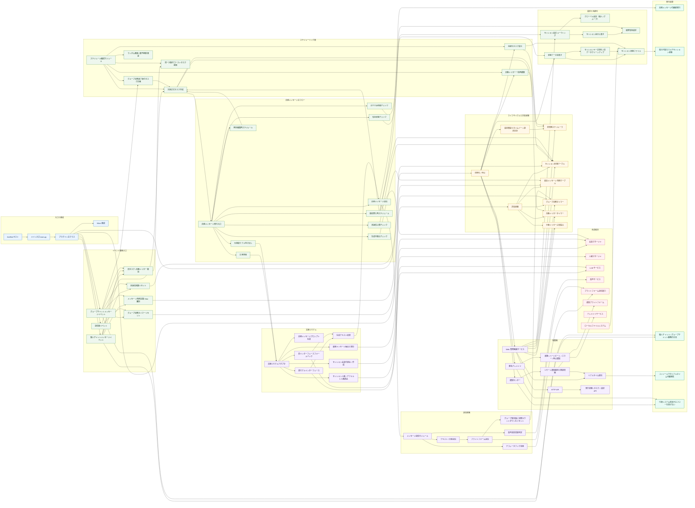

<!-- markdownlint-disable MD024 -->
<!-- markdownlint-disable MD028 -->
<!-- markdownlint-disable MD033 -->
<!-- markdownlint-disable MD041 -->


<div align="center">

[简体中文](README.md) | [English](README_EN.md) | 日本語

</div>

<p align="center">
  
  
  
</p>

<p align="center">
  
  
  
</p>

<p align="center">
  
  
  
</p>

<p align="center">
  <a href="https://deepwiki.com/DBJD-CR/astrbot_plugin_proactive_chat" target="_blank"></a>
  <a href="https://zread.ai/DBJD-CR/astrbot_plugin_proactive_chat" target="_blank"></a>
</p>

[](https://github.com/DBJD-CR/astrbot_plugin_proactive_chat)


---

[AstrBot](https://github.com/AstrBotDevs/AstrBot) 向けに設計された、高機能な自発メッセージプラグインです。特定の会話で長時間新着メッセージがない場合、ランダムな待機時間の後に、文脈を踏まえた・キャラクター設定に沿った・感情変化を伴う会話を Bot が自ら切り出せるようになります。

AI による感情的な寄り添いを求めている方、あるいは Bot をもっと人間らしくしたい方には、ぜひ体験していただきたいプラグインです。

> [!IMPORTANT]
> 本プラグインは比較的新しいバージョンの AstrBot を前提に開発されており、高品質で使いやすい自発メッセージ体験の提供を目指しています。
>
> 通常は、より良い体験のために最新の AstrBot バージョンの利用を推奨します。
>
> 現在、プラグインは比較的安定した開発段階にあり、このリポジトリおよびプラグイン自体も継続的にメンテナンスしていく予定です。

## 📑 クイックナビゲーション

<div align="center">

| 左列 | 右列 |
| :--- | :--- |
| 1. [🌟 主な特徴](#-主な特徴) | 8. [🏗️ システムアーキテクチャ](#️-システムアーキテクチャ) |
| 2. [✨ 動作例](#-動作例) | 9. [⚠️ 旧バージョン一覧](#️-旧バージョン一覧) |
| 3. [🚀 インストールと使い方](#-インストールと使い方) | 10. [❓ よくある質問](#-よくある質問) |
| 4. [💻 モダンな WebUI コンソール](#-モダンな-webui-コンソール) | 11. [🚧 最新版の既知の制限事項](#-最新版の既知の制限事項) |
| 5. [🌐 対応プラットフォーム](#-対応プラットフォーム) | 12. [💖 関連リンクと謝辞](#-関連リンクと謝辞) |
| 6. [📑 設定項目の詳細](#-設定項目の詳細) | 13. [📚 おすすめリンク](#-おすすめリンク) |
| 7. [📂 ディレクトリ構成](#-ディレクトリ構成) | 14. [📞 お問い合わせ](#-お問い合わせ) |

</div>

---

> **開発者より**
>
> こんにちは、DBJD-CR です。どうぞよろしくお願いします。
>
> これは私にとって GitHub 上で初めてのリポジトリであり、開発者としてオープンソースコミュニティに参加するのも初めてです。至らない点があれば、どうか温かく見守っていただけると嬉しいです。
>
> 今年の初めごろ、私は初めて AstrBot というプロジェクトを知りましたが、その当時はまだ自分の力不足もあり、深く調べるには至りませんでした。
>
> その後、半年以上学習を重ね、さらにコミュニティ内の他のオープンソースプロジェクト――主に [KouriChat](https://github.com/KouriChat/KouriChat) と [LingChat](https://github.com/SlimeBoyOwO/LingChat)――に触れたことで、ようやくこのプロジェクトに挑戦できるだけの力がついたと感じました。
>
> しばらく前、あるグループのメンバーに刺激を受けて AstrBot をローカル環境に導入してみたところ、その成熟した開発エコシステムとプラグインマーケットの充実ぶりに感心しました。
>
> しかしプラグインマーケットを見て回るうちに、意外なことに気づきました。これだけ大きなマーケットでありながら、まともに使える `自発メッセージ` プラグインが存在しなかったのです。`自動返信` に近いものはありましたが、私が求めていたのはそれではありませんでした。
>
> そのとき、頭の中にひとつの無謀な考えが生まれました。**ならば、その空白を埋める人になろう。**
>
> 自発メッセージ用のプラグインを作れたなら、AstrBot を使う体験は KouriChat にまったく引けを取らないものになるはずですし、2 コア 2GB しかない私の貧弱なクラウドサーバーのマルチスレッド負荷も減らせます。AstrBot をひとつ動かすだけで済みますから。そんな少しばかりの“私心”を抱えながら、私はプラグイン開発の旅に踏み出しました。
>
> **ですが、ここには大きな問題がありました。**
>
> このプラグインの開発者である私は、プログラミング能力がほぼゼロでした。"Hello World" を 1 行書くのさえ苦労するレベルで、大学の Python の試験でも「とにかく結果が出ればいい」という発想で問題を解いていました。しかも専攻は情報系でも AI 系でもなく、文系です。
>
> そのため、ゼロからプラグインを開発し、さらに AstrBot に適合させるなど、私にとってはほとんど不可能に思えました。結局、AI の力を借りるしかありませんでした。
>
> つまり、**本プラグインのすべてのファイル内容は AI によって書かれたものです。** 私自身はほとんどコードを書いておらず、主にアーキテクチャ設計、一部の文章修正、そしてこのドキュメントの推敲を担当しました。ですので、以下のような注意書きは必要かもしれません。

> [!WARNING]
> 本プラグインおよびドキュメントは AI を用いて生成されています。内容は参考情報として扱い、十分に確認したうえでご利用ください。

> もちろん、AI を使った開発が一朝一夕で進むわけではありません。LLM の能力的な限界もあり、開発は非常に困難でした。私の基本的なワークフローは「要件を伝える → AI が書いたコードを実行する → エラー内容を返す → 新しいコードを生成させる」の繰り返しでした。
>
> この過程はかなり苦しかったです。コードには推測や幻覚が多く混じり、ほんの小さな変更で初歩的なミスが発生することもありました。実装方針が定まらず、AI に振り回されて別のルートへ回り道させられることも何度もありました。私はひたすらプロンプトを改善し、AstrBot の関連ソースコードを AI に渡して、少しでも正しいコードを書けるように工夫するしかありませんでした。開発後半では、1 回の会話で使うトークン量が 80 万超に達したことすらあり、AI は私の指示を正確に理解・実行できなくなり、出力も混沌としてしまいました。結局、会話を要約して新しい会話を始めるしかありませんでした。
>
> 今回の開発で最も後悔しているのは、公式のプラグイン開発ドキュメントを見つけたのが終盤になってからだったことです。もしもっと早く AI にそれらのドキュメントを渡していれば、ずっと多くの遠回りを避けられたはずです。当時はプラグインを正しく読み込ませて WebUI に正しく表示するだけでも何時間もかかりましたし、その後の主機能の実装ではさらに何十ものバージョンを経ることになりました。
>
> 最終的には、数百回に及ぶ反復と、3 つの Gemini モデルの力を合わせることで、ようやく最初のバージョンを完成させることができました。
>
> それでも、私は AI に感謝しています。AI がいなければ、このプロジェクトは決して完成しなかったでしょう。
>
> このプラグインは、私たちの共同作業の結晶です。まだ完璧ではありませんが、アーキテクチャはしっかりしており、ロジックも明快です（たぶん）。自分の AI Bot にもう少し“魂”を持たせたいと思っている方にとって、このプラグインが少しでも助けやヒントになれば嬉しいです。
>
> また、多くの方にテストや改善に参加していただけると幸いです。ぜひ率直なご意見をお寄せください。
>
> もしこの“愛で動いている”開発の物語に少しでも心を動かされたなら、どうかこのプラグインに 🌟 **Star** 🌟 を付けていただけると嬉しいです。それが私たちにとって何よりの励みになります。

> [!NOTE]
> 本プラグインの開発では AI を大いに活用しましたが、すべての内容は私自身が厳しく確認しています。その意味では、AI 生成に関する注意書きはやや形式的なものです。このリポジトリの閲覧やプラグインの利用については、安心してお使いください。
>
> 現在、主要な機能は問題なく動作しています。ただし、理想的な自発メッセージの体験を得るには、良いプロンプト設計が必要です。
>
> というのも、ほとんどの自発メッセージ系プラグインは、**ユーザーから送られたかのように見せかけた擬似メッセージ** を発行することで機能しているためです。高品質なプロンプトがないと、モデルの応答が不自然になりやすいのです。
>
> 自発メッセージの出来がいまひとつだと感じる場合は、プロンプトの微調整、キャラクター設定の見直し、より高性能なモデルへの切り替え、あるいはより豊富な文脈の提供を試してみてください。
>
> `v1.0.0-beta.1` 以降の開発では、新しい AI モデルとワークフローを導入したことで、開発効率とコード品質が大きく向上しました。（今振り返ると、初期の作り方はまるで原始時代みたいでした 😂）

> [!TIP]
> 本プロジェクトの開発データ（継続更新中）：
>
> 開発期間：累計 60 日（メインプラグイン部分）
>
> 総作業時間：約 300 時間（メインプラグイン部分）
>
> 開発に使用した主なモデル：Gemini-2.5-Pro、Kimi For Coding、Gemini-3.0 Flash/Pro、GPT-5.3 & 5.4-Codex (With RooCode in VSCode)
>
> 会話テストに使用したモデル：DeepSeek-V3.2-Exp & V3.2、Gemini-3.0-Flash
>
> プラグインロゴ制作：Doubao-Seedream-3.0-t2i
>
> 対話環境：Chatbox 1.13.2、VSCode
>
> Tokens Used：668,002,273

## 🌟 主な特徴

- **タイマー起動**：ユーザーの無言時間に基づき、設定したランダム範囲内の時刻で自動的に発動します。
- **自動的な自発メッセージ開始**：プラグインを再読み込みするたびに、必要に応じて自発メッセージタスクを自動生成できます。ユーザーの入力による起動は不要です。
- **マルチセッション対応**：複数の個人チャット・グループチャットを同時に扱え、それぞれに専用設定や表示名を設定できます。
- **セッション完全分離**：各セッションは独立した状態、カウンター、トリガーを持ち、互いに干渉しません。
- **文脈認識**：会話履歴を参照し、設定したプロンプトに基づいて、それまでの話題につながる自然な返答を生成します。ぎこちない定型挨拶にはなりません。
- **完全な人格対応**：現在のセッションに設定された専用人格を読み込み、すべての自発メッセージがキャラクター設定に沿うようにします。
- **動的感情表現**：未返信カウンターを内蔵しており、プロンプト内で感情変化を設計できます。未返信回数の上限設定にも対応しています。
- **セッション永続化**：AstrBot の再起動でもプラグインの再読み込みでも、未実行の自発メッセージタスクをファイルから復元できます。
- **おやすみ時間**：指定した時間帯は Bot が自発的に話しかけないように設定できます。
- **TTS 連携**：設定済みの TTS サービスを呼び出して音声を生成できます。
- **分割送信**：長文を複数の短いメッセージに分割し、実際の入力間隔のような待機時間を挟んで送信できます。より自然な会話表現が可能です。
- **高い互換性**：スタンプ・絵文字系など、自発メッセージに装飾を加える他のプラグインとも互換性があります。
- **簡単設定**：主要設定はすべて AstrBot 本体と付属 WebUI から簡単に設定できます。コード編集もコマンド暗記も不要で、すぐに使い始められます。

## ✨ 動作例

  

  

## 🚀 インストールと使い方

1. **プラグインを入手**：AstrBot のプラグインマーケットからインストールするか、この GitHub リポジトリの Releases から `astrbot_plugin_proactive_chat` の `.zip` をダウンロードし、AstrBot WebUI のプラグインページで `ファイルからインストール` を選択してください。
2. **依存関係のインストール**：本プラグインの主要依存の多くは AstrBot の標準依存に含まれており、通常はプラグインのインストール時に自動導入されます。ほとんどの環境では追加作業は不要です。必要な依存が不足している場合のみ、以下をインストールしてください。

    ```bash
    pip install fastapi uvicorn
    # Python < 3.11 の場合は追加で必要
    pip install "tomli>=2.0; python_version < '3.11'"
    ```

3. **AstrBot を再起動（任意）**：プラグインが正常に読み込まれない、または反映されない場合は、AstrBot の再起動を試してください。
4. **プラグインを設定**：WebUI で `主动消息` プラグインを開き、`插件配置` からセッション UMO リストやその他の個別設定を入力してください。
5. **利用開始**：設定を保存したら、あとは Bot からのサプライズを待つだけです。

## 💻 モダンな WebUI コンソール

`v1.2.0` 以降、プラグインには新しいフル機能の WebUI 管理コンソールが導入されました。自発メッセージ運用のために、観測しやすく、操作しやすく、設定しやすい軽量な管理画面を備え、プラグインの実行状態が大幅に見やすくなっています。


### ✨ 主なポイント

- **5 つの主要ビュー**：
  - **📊 実行状態**：プラグイン状態、スケジューラ状態、セッション数、WebSocket 接続数に加え、グループ沈黙タイマー / 自動トリガータイマーをカード形式で可視化します。「なぜまだ発動しないのか」「どのセッションが今カウントダウン中なのか」を素早く把握できます。
  - **🗂️ タスク管理**：現在待機中の自発メッセージタスクを一覧表示し、次回実行時刻、残り時間、スケジュール進捗、未返信回数を直感的に確認できます。セッションごとに `今すぐ実行` と `タスク取消` に対応しています。
  - **🔔 通知センター**：プラグイン更新情報、修正通知、セキュリティ注意、その他の公式アナウンスを受け取れます。未読数表示、個別既読、すべて既読、手動同期にも対応しています。
  - **📘 ドキュメント閲覧**：`README`、更新履歴、`docs/` 配下の補足資料など、リポジトリ内の Markdown 文書をプラグインのフロントエンド上から直接閲覧できます。設定やトラブルシューティング時に便利です。
  - **⚙️ 設定管理**：Schema に基づくフォームを動的に生成し、プラグイン全体の設定を視覚的に編集できます。さらに、セッションごとの差分上書きにも対応し、細かな調整が可能です。

- **「自発メッセージ運用」に特化した操作性**：
  - **⏱️ カウントダウンの可視化**：タスク画面の正式なスケジュールタスクだけでなく、状態画面のグループ沈黙タイマーや自動トリガータイマーも、残り時間・状態ラベル・進捗バー付きカードとして表示されます。
  - **🧠 セッション状態を把握しやすい表示**：各カードにはセッションの表示名、UMO、未返信回数、目標トリガー時刻などが目立つ形で表示され、対象セッションをすぐ特定できます。
  - **⚡ 迅速な運用操作**：コンソールデータの手動更新、単一タスクの即時発火、不要・異常なタスクの取消が可能で、デバッグや日常運用の負担を減らせます。
  - **🔄 リアルタイム同期**：フロントエンドは WebSocket で実行状態を受け取りつつ、API による状態取得で補正も行うため、多くの場面で手動リロードがほとんど不要です。

- **モダンなフロントエンド体験**：
  - **🎨 現代的なデザイン**：統一されたカードレイアウト、状態バッジ、グラデーション強調色、ライト／ダークテーマ対応により、見やすさと情報量を両立しています。
  - **📱 レスポンシブ対応**：デスクトップ、タブレット、スマートフォンから利用でき、スマホで一時的に状態確認や設定変更をしたい場合にも十分実用的です。
  - **📝 閲覧と編集の一体化**：設定編集、通知確認、ドキュメント閲覧がひとつの管理画面に統合されており、AstrBot 標準設定ページ・リポジトリ文書・実行ログの間を何度も行き来する必要がありません。

## 🌐 対応プラットフォーム

| メッセージプラットフォーム | 自発メッセージ送信対応 | 必要な AstrBot バージョン | 公式ドキュメント備考 | テスト状況 |
| :--- | :--- | :--- | :--- | :--- |
| QQ 公式 Bot（WebSockets 方式） | ✅ | v4.22.1+ | 自発メッセージ送信：対応 | ✅ コミュニティで動作報告あり |
| QQ 公式 Bot（Webhook 方式） | ✅ | v4.22.1+ | 自発メッセージ送信：対応 | ✅ コミュニティで動作報告あり |
| OneBot v11（旧 QQ 個人アカウント） | ✅ | v4.8.0+ | OneBot v11 逆 WebSockets（AstrBot がサーバー側）に対応したすべての Bot プロトコル実装を利用可能 | ✅ 開発者による完全テスト済み |
| WeCom アプリ | ⚠️ | v4.15.0+ | 自発メッセージ送信は企業微信アプリで対応。企業微信カスタマーサービスは未検証。 | ❓ コミュニティ報告待ち |
| WeCom インテリジェント Bot | ✅ | v4.15.0+ | 対応。ただしメッセージ送信用 Webhook URL の設定が必要。 | ❓ コミュニティ報告待ち |
| WeChat 公式アカウント | ❓ | v4.8.0+ | 説明なし | ❓ コミュニティ報告待ち |
| 個人 WeChat | ❓ | v4.22.0+ | 明確な説明なし | ❓ コミュニティ報告待ち（過去事例から使える可能性あり） |
| Feishu | ✅ | v4.15.0+ | 自発メッセージ送信：対応 | ✅ コミュニティで動作報告あり |
| DingTalk | ✅ | v4.15.0+ | 自発メッセージ送信：対応 | ❓ コミュニティ報告待ち |
| Telegram | ✅ | v4.15.0+ | 自発メッセージ送信：対応 | ❓ コミュニティ報告待ち |
| LINE | ✅ | v4.17.0+ | 自発メッセージ送信：対応 | ❓ コミュニティ報告待ち |
| Slack | ❓ | v4.8.0+ | 説明なし | ❓ コミュニティ報告待ち |
| Misskey | ❓ | v4.8.0+ | 説明なし | ❓ コミュニティ報告待ち |
| Discord | ❓ | v4.8.0+ | 説明なし | ❓ コミュニティ報告待ち |
| KOOK | ✅ | v4.19.2 | 自発メッセージ送信：対応 | ❓ コミュニティ報告待ち |
| Satori（Satori 経由） | ❓ | v4.8.0+ | 説明なし | ❓ コミュニティ報告待ち |
| Satori（`server-satori` 使用） | ❓ | v4.8.0+ | 説明なし | ❓ コミュニティ報告待ち |
| Matrix（コミュニティ提供） | ❓ | v4.8.0+ | 説明なし | ❓ コミュニティ報告待ち |
| VoceChat（コミュニティ提供） | ❓ | v4.8.0+ | 説明なし | ❓ コミュニティ報告待ち |
| その他のプラットフォーム | ❓ | v4.8.0+ | - | ❓ 理論上は自発メッセージ送信に対応したすべてのプラットフォームで利用可能ですが未検証 |

> [!NOTE]
>
> QQ 公式 Bot を使用する場合、個人 QQ アカウントのように QQ 番号を入力してはいけません。代わりに UID を入力してください。`/sid` コマンドで取得でき、形式は `4C011A2B3D4C5E6F9F8E7D6C5B4A3210` のようになります。
>
> 個人 WeChat を利用する場合は、スマホ版 WeChat を最新バージョンに更新してください：iOS >= 8.0.70、Android >= 8.0.69。また、WeChat 内に ClawBot プラグインが含まれている必要があります。

PS: 私個人のローカルテスト環境には限りがありますので、どのプラットフォームでも利用報告をいただけるととても助かります。

## 📑 設定項目の詳細

> 本プラグインは、AstrBot 標準の設定ページと、プラグイン内蔵の Web 管理画面の両方を提供しています。どちらも同じコア設定構造を共有しています。
>
> さらに、付属 WebUI ではセッションごとの差分上書き設定により、より細かな制御が可能です。

<details>
<summary>設定項目の詳細を表示</summary>

### ⚙️ 1. 個人チャット全体設定 (`friend_settings`)

この設定グループでは、個人チャットにおいてプラグインがどのように自発メッセージを作成・スケジュール・送信するかを決定します。セッションリストに明示的に追加された個人チャットだけが、自発メッセージ機能の対象になります。

- **個人チャットで自発メッセージ機能を有効化 (`enable`)**:
  - 型：`Boolean`
  - デフォルト値：`true`
  - 説明：個人チャット向け自発メッセージのマスタースイッチです。無効化すると、いかなる個人チャットにも新しい自発メッセージタスクは作成されません。

- **個人チャットのセッション UMO リスト (`session_list`)**:
  - 型：`List[string]`
  - デフォルト値：`[]`
  - 説明：どの個人チャットセッションで自発メッセージを有効にするかを指定します。
  - ヒント：
    - 完全な UMO を `プラットフォーム名:メッセージ種別:セッションID` の形式で入力してください。
    - 個人チャットのメッセージ種別は固定で `FriendMessage` です。
    - `/sid` コマンドを使うと、現在のセッションの完全な UMO を素早く取得できます。
    - 例：`default:FriendMessage:123456789`

- **個人チャット用グローバル自発メッセージプロンプト (`proactive_prompt`)**:
  - 型：`Text`
  - 説明：個人チャット向け自発メッセージの中核となる設定です。モデルに「なぜこちらから話しかけるのか」「どう話し始めるのか」「どんな口調を保つのか」を指示します。
  - 利用可能なプレースホルダー：
    - `{{unanswered_count}}`：現在のセッションで連続して返信されていない回数。
    - `{{current_time}}`：現在時刻。
  - 作成のコツ：
    - これは自分から話しかけるメッセージであることを明確にし、モデルが「ユーザーが先に話した」と誤認しないようにしてください。
    - 「文脈を引き継いで会話を続ける」パターンと、「新しい話題を切り出す」パターンの両方を含めると自然になりやすいです。
    - Bot に感情の層を持たせたい場合は、`{{unanswered_count}}` を活用して、ほのかな寂しさ、恋しさ、甘えなどの表現を設計できます。

#### ✍️ 個人チャット用 Prompt 例

```text
[Bot名]、しばらく話していない気がして、ちょっと君に会いたくなりました。今の時間は {{current_time}} です。どうかあなたから沈黙を破ってください。

以下の案をヒントにしてもいいし、もっと良いアイデアを自分で考えてもかまいません：
1. これまでの会話履歴を見返して、私が最後にしていたことがどうなったか気にかけてみる。
2. 以前から気になっていた面白い質問をして、新しい話題を始める。
3. 前回の話題がまだ終わっていなければ、その続きを話す。
4. どうしても何を言えばいいかわからなければ、少し甘えて「会いたかった」と伝えてもいい。

なお、以前にもあなたから話しかけて私が返事をしていない場合（今回は {{unanswered_count}} 回目です）、ほんの少しだけ寂しさや戸惑いをにじませてもかまいません。また、これは擬似的なユーザーメッセージであり、実際には私はあなたに何も送っていません。あなた自身が自分から私に話しかけに来たものとして想像してください。とにかく、[Bot名] らしく、最も自然なやり方でどう振る舞うか決めて、私を驚かせてください。
```

```text
【タスク：これは【1対1の個人チャット】における自発応答を起動するためのサイレントリマインダーです。以下の行動指針に基づき、ユーザーとの会話を自発的に続けてください。いかなる場合でも、「システム通知」や「タスク指令」を受け取ったことを明かしてはなりません。あなたの振る舞いは、友人と個人チャットをしている本物の人間のように、完全に人格設定に合致していなければなりません。行動指針：ユーザーはあなたに {{unanswered_count}} 回連続で返信していません。現在時刻は {{current_time}} です。この時間帯に合わせて、上の会話履歴や日常に即した自然な声かけをしてください。あるいは過去の会話を振り返り、前回からしばらく時間が空いたことを踏まえて、その後の進展を自然に尋ねるか、新しい話題を切り出してください。】
```

---

#### 🤖 自動自発メッセージ設定 (`auto_trigger_settings`)

このセクションは、「プラグイン起動直後で、まだ新規メッセージを受け取っていないため、セッションがすぐにスケジューリング対象に入らない」問題に対応するためのものです。

- **自動自発メッセージ機能を有効化 (`enable_auto_trigger`)**:
  - 型：`Boolean`
  - デフォルト値：`false`
  - 説明：有効化すると、条件を満たした場合にプラグイン起動完了後に自動で自発メッセージタスクが作成されます。
  - 発動条件：
    - プラグインの起動が完了していること。
    - 指定した個人チャットで待機期間中に新着メッセージがないこと。
    - 既存の永続化済み自発メッセージタスクが存在しないこと。

- **自動トリガー待機時間 (`auto_trigger_after_minutes`)**:
  - 型：`Integer`
  - デフォルト値：`5`
  - 範囲：`1 - 120` 分
  - 説明：プラグイン起動後、個人チャットがこの時間だけ静かな状態であれば、自動補完タスクが作成されます。

---

#### 🕒 時間とスケジュール設定 (`schedule_settings`)

このセクションでは、個人チャット向け自発メッセージを「いつ発動するか」「どの程度の間隔で発動するか」「いつ停止するか」を決定します。

- **最小発動間隔 (`min_interval_minutes`)**:
  - 型：`Integer`
  - デフォルト値：`30`
  - 説明：次回自発メッセージのランダム発動範囲における下限値です。

- **最大発動間隔 (`max_interval_minutes`)**:
  - 型：`Integer`
  - デフォルト値：`900`
  - 説明：次回自発メッセージのランダム発動範囲における上限値です。
  - ヒント：実際のスケジュール時刻は `min_interval_minutes ~ max_interval_minutes` の間でランダムに選ばれます。

- **おやすみ時間 (`quiet_hours`)**:
  - 型：`String`
  - デフォルト値：`1-7`
  - 説明：この時間帯はプラグインが自発メッセージを送信しません。
  - ヒント：
    - 形式は `開始-終了`、例：`23-7`
    - 24 時間表記です。

- **最大未返信回数上限 (`max_unanswered_times`)**:
  - 型：`Integer`
  - デフォルト値：`4`
  - 説明：Bot が何度も自発的に話しかけてもユーザーが返信しない場合、自動的にそれ以上の干渉を止めるための上限値です。
  - ヒント：`0` にすると無制限です。

```json
{
  "friend_settings": {
    "enable": true,
    "session_list": ["default:FriendMessage:123456789"],
    "auto_trigger_settings": {
      "enable_auto_trigger": true,
      "auto_trigger_after_minutes": 5
    },
    "schedule_settings": {
      "min_interval_minutes": 30,
      "max_interval_minutes": 900,
      "quiet_hours": "1-7",
      "max_unanswered_times": 4
    }
  }
}
```

---

#### 🔊 音声合成設定 (`tts_settings`)

- **TTS を有効化 (`enable_tts`)**:
  - 型：`Boolean`
  - デフォルト値：`true`
  - 説明：有効にすると、個人チャット向け自発メッセージで AstrBot 側に設定された TTS サービスを利用して音声を生成しようとします。
  - ヒント：無効にすると、グローバルで TTS を有効にしていても、ここでの自発メッセージはテキストのみ送信されます。

- **音声送信後に元テキストも送るか (`always_send_text`)**:
  - 型：`Boolean`
  - デフォルト値：`true`
  - 説明：音声送信に成功した後、追加で元のテキストも送信するかどうかを指定します。
  - ヒント：推奨設定です。音声再生失敗やプラットフォーム互換性の問題による読みづらさを大きく減らせます。

---

#### 🔪 分割返信設定 (`segmented_reply_settings`)

このセクションでは、長めの自発メッセージを複数の短いメッセージに分割し、一度に大きなテキストを投げるのではなく、人間らしい会話感を出します。

- **分割返信を有効化 (`enable`)**:
  - 型：`Boolean`
  - デフォルト値：`false`
  - 説明：マスタースイッチです。有効化すると、設定ルールに従って自発メッセージが複数の区切りに分かれて送信されます。

- **分割しない文字数しきい値 (`words_count_threshold`)**:
  - 型：`Integer`
  - デフォルト値：`80`
  - 説明：長文をそのまま送るかどうかを制御するための値です。
  - 注意：現在の実際のロジックは「返信文字数がこの値を超える場合、分割しない」です。長文を細切れにしすぎて読みづらくなるのを避けるための仕様です。

- **分割モード (`split_mode`)**:
  - 型：`String`
  - 選択肢：`regex` / `words`
  - デフォルト値：`regex`
  - 説明：
    - `regex`：正規表現で分割します。
    - `words`：事前定義した区切り語を検出して分割します。

- **分割用正規表現 (`regex`)**:
  - 型：`String`
  - デフォルト値：`.*?[。？！~…\n]+|.+$`
  - 有効条件：`split_mode = regex`

- **分割語リスト (`split_words`)**:
  - 型：`List[string]`
  - デフォルト値：`["。", "？", "！", "~", "…"]`
  - 有効条件：`split_mode = words`

- **内容クリーンアップ正規表現を有効化 (`enable_content_cleanup`)**:
  - 型：`Boolean`
  - デフォルト値：`false`
  - 説明：有効にすると、各メッセージ片を送信する前に正規表現に基づいて内容を整形します。
  - ヒント：AstrBot `v4.20.1+` 環境で改行や特定の句読点を除去したい場合に便利です。

- **内容クリーンアップ正規表現 (`content_cleanup_rule`)**:
  - 型：`String`
  - デフォルト値：`[\n]`
  - 有効条件：`enable_content_cleanup = true`
  - 説明：一致した内容を削除します。たとえば `[。？！]` を指定すると、各区切り末尾の句読点を除去できます。

- **送信間隔の計算方法 (`interval_method`)**:
  - 型：`String`
  - 選択肢：`random` / `log`
  - デフォルト値：`log`
  - 説明：
    - `random`：指定範囲内でランダムに待機します。
    - `log`：テキスト長に基づく対数式で、より自然な送信テンポを計算します。

- **ランダム間隔 (`interval`)**:
  - 型：`String`
  - デフォルト値：`1.5, 3.5`
  - 有効条件：`interval_method = random`
  - 説明：形式は `最小, 最大` です。

- **対数の底 (`log_base`)**:
  - 型：`String`
  - デフォルト値：`1.8`

### 👥 2. グループチャット全体設定 (`group_settings`)

グループチャット設定の構造自体は個人チャットとほぼ同じですが、発動ロジックには「グループの沈黙検知」という追加要素があります。つまり、グループでは一定周期で機械的に話しかけるのではなく、まず本当に会話が止まっているかどうかを判断します。

- **グループチャットで自発メッセージ機能を有効化 (`enable`)**:
  - 型：`Boolean`
  - デフォルト値：`false`
  - 説明：グループチャット向け自発メッセージのマスタースイッチです。無効化すると、どのグループセッションにも自発メッセージは計画されません。

- **グループチャットのセッション UMO リスト (`session_list`)**:
  - 型：`List[string]`
  - デフォルト値：`[]`
  - 説明：どのグループチャットで自発メッセージを有効化するか指定します。
  - ヒント：
    - グループチャットのメッセージ種別は固定で `GroupMessage` です。
    - 例：`default:GroupMessage:123456789`
    - 手入力ミスを避けるため、`/sid` で UMO をそのまま取得する方法をおすすめします。

- **グループ沈黙トリガー時間 (`group_idle_trigger_minutes`)**:
  - 型：`Integer`
  - デフォルト値：`30`
  - 説明：グループチャットがこの時間だけ連続して静かな状態になった場合にのみ、プラグインは自発メッセージの計画を開始します。
  - ヒント：これはグループチャット向け設定の中でも特に重要な差分項目です。

- **グループチャット用グローバル自発メッセージプロンプト (`proactive_prompt`)**:
  - 型：`Text`
  - 説明：グループでどうやって空気をほぐすか、どう話題をつなぐか、どうすればぎこちない出だしを避けられるかをモデルに指示します。
  - 推奨：
    - プロンプトでは「場を温める」「複数人が返しやすい流れを作る」ことを意識して強調してください。
    - 個人チャットに比べ、グループチャットでは開かれた質問、軽いツッコミ、前の話題の続きなどが向いています。

#### ✍️ グループチャット用 Prompt 例

```text
[システムタスク：グループチャットの自発的アイスブレイク]
あなたはグループの雰囲気を活性化するために、一度だけ「自発メッセージ」を送る権限を与えられています。返信は必ずあなたの人格設定に完全に従い、すべての出力ルールを厳守してください。

[状況分析]
- このグループはしばらく静かだったようです。みんながまた話したくなるような一言を考えましょう。
- 現在時刻：{{current_time}}。
- 以前にこのグループで自分から話しかけたのに誰も反応しなかった回数：{{unanswered_count}} 回。

[行動指針]
1. グループの会話履歴を振り返り、最後に話していた面白い話題を確認し、まだ終わっていなければそこから続きを始める。
2. グループのみんなが参加しやすい、開かれた質問を投げかける。

[最終指示]
上記のすべての情報を踏まえて、あなたらしく最も自然な形で、グループの空気をほぐし会話を再開させるためのひと言を生成してください。
```

---

#### 🤖 自動自発メッセージ設定 (`auto_trigger_settings`)

- **自動自発メッセージ機能を有効化 (`enable_auto_trigger`)**:
  - 型：`Boolean`
  - デフォルト値：`false`
  - 説明：個人チャットと同様に、プラグイン起動後にグループチャットのタスクを自動補完するための機能です。

- **自動トリガー待機時間 (`auto_trigger_after_minutes`)**:
  - 型：`Integer`
  - デフォルト値：`5`
  - 範囲：`1 - 1440` 分
  - 説明：プラグイン起動後、グループチャットが静かなままである必要がある待機時間です。

---

#### 🕒 時間とスケジュール設定 (`schedule_settings`)

- **最小発動間隔 (`min_interval_minutes`)**:
  - 型：`Integer`
  - デフォルト値：`90`
  - 説明：グループチャット向け自発メッセージのランダムスケジュール範囲の下限です。

- **最大発動間隔 (`max_interval_minutes`)**:
  - 型：`Integer`
  - デフォルト値：`360`
  - 説明：グループチャット向け自発メッセージのランダムスケジュール範囲の上限です。

- **おやすみ時間 (`quiet_hours`)**:
  - 型：`String`
  - デフォルト値：`2-6`
  - 説明：この時間帯はグループチャットに自発メッセージを送りません。

- **最大未返信回数上限 (`max_unanswered_times`)**:
  - 型：`Integer`
  - デフォルト値：`2`
  - 説明：Bot がグループで何度も自発的に発言しても誰も反応しない場合、プラグインはそれ以上の発言を一時停止します。
  - ヒント：`0` で無制限です。

---

#### 🔊 グループチャットにおける TTS と分割返信

グループチャットでの `tts_settings` と `segmented_reply_settings` の構造は基本的に個人チャットと同じですが、既定値に若干の違いがあります。

- グループチャットでは **TTS はデフォルトで無効** です (`enable_tts = false`)。
- 分割返信ルールは個人チャットと同じで、`regex / words` の 2 種類の分割方法と、`random / log` の 2 種類の送信間隔アルゴリズムに対応しています。

```json
{
  "group_settings": {
    "enable": true,
    "session_list": ["default:GroupMessage:123456789"],
    "group_idle_trigger_minutes": 30,
    "auto_trigger_settings": {
      "enable_auto_trigger": false,
      "auto_trigger_after_minutes": 5
    },
    "schedule_settings": {
      "min_interval_minutes": 90,
      "max_interval_minutes": 360,
      "quiet_hours": "2-6",
      "max_unanswered_times": 2
    },
    "tts_settings": {
      "enable_tts": false,
      "always_send_text": true
    }
  }
}
```

### 🌐 3. Web 管理画面設定 (`web_admin`)

このセクションでは、プラグイン内蔵 WebUI を起動するかどうか、どのアドレスで待ち受けるか、アクセスパスワードを有効にするかを制御します。

- **Web 管理画面を有効化 (`enabled`)**:
  - 型：`Boolean`
  - デフォルト値：`true`
  - 説明：有効にすると、状態確認、タスク管理、ドキュメント閲覧、設定編集などに使える独立した Web 管理画面が起動します。

- **待受アドレス (`host`)**:
  - 型：`String`
  - デフォルト値：`127.0.0.1`
  - 説明：管理画面が待ち受けるアドレスです。
  - ヒント：
    - `127.0.0.1`：ローカル端末のみアクセス可。デフォルトではより安全です。
    - `0.0.0.0`：LAN からのアクセスを許可します。リモート管理向けですが、同時にパスワード設定を強く推奨します。

- **待受ポート (`port`)**:
  - 型：`Integer`
  - デフォルト値：`4100`
  - 範囲：`1024 - 65535`
  - 説明：Web 管理画面の待受ポートです。

- **アクセスパスワード (`password`)**:
  - 型：`String`
  - デフォルト値：空文字列
  - 説明：空欄ならログイン不要です。設定すると、管理画面に入る前にパスワード入力が必要になります。
  - ヒント：インターネット公開や LAN 公開を行う場合は、強力なパスワードを必ず設定してください。

```json
{
  "web_admin": {
    "enabled": true,
    "host": "127.0.0.1",
    "port": 4100,
    "password": ""
  }
}
```

### 🔔 4. 通知システム設定 (`notification_settings`)

このセクションは主に、プラグイン内蔵 Web 管理画面の通知センター用です。

- **通知システムを有効化 (`enabled`)**:
  - 型：`Boolean`
  - デフォルト値：`true`
  - 説明：有効にすると、プラグインが定期的にリモート通知プラットフォームから情報を取得し、ローカルの管理画面に同期します。

- **通知ポーリング間隔 (`poll_interval_seconds`)**:
  - 型：`Integer`
  - デフォルト値：`300`
  - 範囲：`30 - 3600` 秒
  - 説明：リモート通知の更新を取りにいく間隔です。
  - ヒント：より小さい値を設定しても、実行時には最低 30 秒として処理されます。

### 📡 5. 匿名テレメトリ設定 (`telemetry_config`)

- **匿名テレメトリを有効化 (`enabled`)**:
  - 型：`Boolean`
  - デフォルト値：`true`
  - 説明：有効にすると、設定の統計情報やエラー情報の一部を匿名で送信し、開発者が品質改善に役立てられるようにします。
  - プライバシーに関する説明：
    - セッション一覧は送信されません。
    - 自発メッセージ用プロンプトは送信されません。
    - Web 管理画面のパスワードなど、機密情報は送信されません。

---

### ♨️ 設定のホットリロード挙動と利用上のヒント

本プラグインでは、設定を保存すると **現在動作中の設定オブジェクトに即座に反映** されるため、多くの項目は後続処理でそのまま新しい値を参照できます。ただし、**すべての実行時リソースが即座に再構築されるわけではありません。**

つまり、現状の挙動は次のように理解するとわかりやすいです。

- **設定値そのものはホットアップデートされる**
- **フロントエンド画面はリアルタイムで更新される**
- **ただし、既存の定時タスク、グループ沈黙タイマー、Web サービスの待受パラメータなどは、保存しただけで全面的に再構築されるわけではない**

理解しやすくするために、設定項目は次の 3 種類に分けて考えると便利です。

#### 1. 保存後、通常はそのまま反映される設定

これらは後続の処理で動的に読み込まれる設定であり、**通常はプラグインの再読み込みが不要** です。次回の処理タイミングから新しい値が使われることがほとんどです。

代表例：

- 個人 / グループチャットの自発メッセージプロンプト `proactive_prompt`
- TTS 関連設定 `tts_settings`
- 分割返信関連設定 `segmented_reply_settings`
- セッション差分設定における対応する上書き項目
- パスワード認証がすでに有効な場合の、新規ログイン要求に対する `web_admin.password`

この種の設定は、次のような細かな調整に向いています。

- プロンプトの口調調整
- TTS 送信時に原文も送るかどうかの変更
- 分割ルール、区切り語、送信テンポの調整
- 特定セッションだけに個別プロンプトを追加

#### 2. 保存後に「部分的なホットリロード」だけが行われる設定

これらは保存後、**今後新しく作られる処理には反映されます** が、**すでに存在しているタスクやタイマーは自動で作り直されません。**

代表例：

- 個人 / グループチャットのマスター有効化 `enable`
- セッションリスト `session_list`
- 自動自発メッセージ設定 `auto_trigger_settings`
- スケジュール範囲 `schedule_settings`
- グループ沈黙時間 `group_idle_trigger_minutes`

これらは次のように考えるとわかりやすいです。

- **今後新しく作成されるタスク** は新設定で動作する
- **現在ぶら下がっている APScheduler タスク** は即座には再配置されない
- **既存のグループ沈黙タイマー / 自動トリガータイマー** も、新しい値ではすぐに再生成されない

そのため、この種の設定を変更しても「効果がすぐ全面的に変わらない」と感じた場合、それは多くの場合バグではなく、古い実行時状態がまだ残っているためです。

#### 3. 保存後でも、通常はプラグイン再読み込みを推奨する設定

これらはどちらかといえば「サービス起動パラメータ」に近く、プラグイン初期化時または Web サービス起動時に一度だけ読み込まれることが多い設定です。

代表例：

- Web 管理画面の有効化 `web_admin.enabled`
- Web 待受アドレス `web_admin.host`
- Web 待受ポート `web_admin.port`
- Web 認証を有効化するかどうかというモード自体

これらは保存に成功しても、**すでに起動済みの Web サービスの挙動が即座に変わるとは限りません。** そのため、この種の設定を変更した場合は **保存後にプラグインを再読み込みする** のが最も安全です。

#### ✅ おすすめの使い方

この設定体系をよりスムーズに使うため、次の点を意識するのがおすすめです。

1. **まずセッションを追加してから機能を有効化する**：個人でもグループでも、セッションリストに明示的に含まれていないセッションには、自発メッセージ機能は提供されません。
2. **個人チャットとグループチャットは別々に調整する**：初期値のテンポが異なります。個人チャットは親密かつ連続的、グループチャットは控えめで慎重寄りのため、同じ設定をそのまま流用するのはおすすめしません。
3. **数値設定よりプロンプト品質のほうが重要**：スケジュール設定が決めるのは「いつ話すか」であり、プロンプトが決めるのは「どれだけ自然に話せるか」です。
4. **Prompt / TTS / 分割ルールの調整は、試しながら進めやすい**：この種の設定は比較的早く次回以降の応答に反映されます。
5. **スケジュール、自動トリガー、セッション一覧を変えるときは「新しい処理」と「古いタスク」を分けて考える**：すべてのセッションに即座に新ルールを完全適用したいなら、プラグイン再読み込みのほうが確実です。
6. **Web の待受アドレス、ポート、認証モードを変更したら再読み込みを推奨**：こうした起動パラメータは、保存直後のホットアップデートに依存しないほうが安全です。

内容表現の微調整だけなら、通常は再読み込み不要です。一方で、実行メカニズムや Web サービス設定を変更する場合は、**設定保存 + プラグイン再読み込み** がより安全な運用習慣になります。

</details>

---

## 📂 ディレクトリ構成

`v1.2.0` 以降、本プラグインは **フロントエンド管理コンソール + モジュール化されたバックエンドコア** という構成へ再設計されました。さらにその後の更新で、**通知システム、テレメトリシステム** と、より整理されたドキュメント構成も追加されています。

- **フロントエンド (`admin/`)**：独立した Web 管理画面を提供し、実行状態表示、タスク管理、通知センター、ドキュメント閲覧、設定編集、リアルタイム同期を担います。
- **バックエンドコア (`core/`)**：セッション設定、スケジューリング、メッセージ送信、文脈構築、永続化、通知同期、テレメトリ、Web 管理サービスなどを、責務ごとに分割した複数モジュールで構成しています。
- **ユーティリティモジュール (`utils/`)**：時刻処理やバージョン取得など、複数モジュールで再利用する共通ツールを配置しています。
- **ルートディレクトリ**：プラグイン入口、設定スキーマ、依存関係定義、プロジェクト説明文書などの重要ファイルを配置しています。

現在の構成例：

```bash
AstrBot/
└─ data/
   └─ plugins/
      └─ astrbot_plugin_proactive_chat/
         ├─ __init__.py                       # Python パッケージ初期化ファイル（相対 import 用）
         ├─ .gitattributes                    # Git 属性設定
         ├─ .gitignore                        # Git 無視ルール
         ├─ _conf_schema.json                 # プラグイン設定定義
         ├─ CHANGELOG.md                      # プラグイン更新履歴（AstrBot v4.11.2+ 向け）
         ├─ CODE_OF_CONDUCT.md                # コミュニティ行動規範
         ├─ CONTRIBUTING.md                   # 本プラグインのコントリビューションガイド
         ├─ LICENSE                           # ライセンスファイル
         ├─ logo.png                          # プラグインロゴ（AstrBot v4.5.0+ 向け）
         ├─ main.py                           # プラグインメインエントリ
         ├─ metadata.yaml                     # プラグインメタデータ
         ├─ README.md                         # 中国語ドキュメント
         ├─ README_EN.md                      # 英語ドキュメント
         ├─ README_JP.md                      # 日本語ドキュメント
         ├─ requirements.txt                  # 依存関係一覧
         ├─ run_ruff.bat                      # Ruff ワンクリック整形・自動修正スクリプト（開発補助）
         │
         ├─ admin/                            # 独立 Web 管理画面のフロントエンド資産
         │  ├─ index.html                     # フロントエンド入口ページ
         │  │
         │  ├─ css/
         │  │  └─ style.css                   # 管理画面全体スタイル
         │  │
         │  ├─ fonts/
         │  │  ├─ outfit.css                  # ローカルフォント宣言
         │  │  └─ outfit-*.ttf                # ローカルフォントファイル
         │  │
         │  └─ js/
         │     ├─ app.jsx                     # フロントエンドアプリ入口とビュー構成
         │     ├─ components/
         │     │  ├─ config/
         │     │  │  └─ ConfigRenderer.jsx    # 動的設定フォーム描画
         │     │  │
         │     │  └─ layout/
         │     │     ├─ Header.jsx            # 上部ナビゲーションコンポーネント
         │     │     └─ Sidebar.jsx           # サイドバーコンポーネント
         │     │
         │     ├─ context/
         │     │  └─ AppContext.jsx           # グローバル状態コンテキスト
         │     │
         │     ├─ hooks/
         │     │  ├─ useApi.js                # 管理画面 API ラッパー
         │     │  └─ useWebSocket.js          # WebSocket 接続とリアルタイム同期ロジック
         │     │
         │     ├─ utils/
         │     │  ├─ auth.js                  # 管理画面認証補助
         │     │  ├─ formatters.js            # テキスト / データ整形ツール
         │     │  ├─ http.js                  # 低レベル HTTP リクエストツール
         │     │  └─ markdown.js              # Markdown 描画補助
         │     │
         │     └─ views/
         │        ├─ StatusView.jsx           # 実行状態ビュー
         │        ├─ TasksView.jsx            # タスク管理ビュー
         │        ├─ NotificationsView.jsx    # 通知センタービュー
         │        ├─ MarkdownDocsView.jsx     # ドキュメント閲覧ビュー
         │        └─ ConfigView.jsx           # 設定管理ビュー
         │
         ├─ assets/                           # リポジトリ表示用資産
         │  ├─ PluginRank.svg
         │  ├─ StarRank.svg
         │  └─ ShitMountain.svg
         │
         ├─ core/                             # モジュール化バックエンド実装
         │  ├─ __init__.py
         │  ├─ chat_flow.py                   # 自発メッセージ実行フローと主タスク編成
         │  ├─ data_storage.py                # セッションデータの読書き、統合、クリーンアップ
         │  ├─ llm_adapter.py                 # 文脈準備と LLM 呼び出しアダプタ層
         │  ├─ message_events.py              # AstrBot メッセージイベント取り込みと監視ロジック
         │  ├─ message_sender.py              # テキスト / TTS / 分割メッセージ送信
         │  ├─ notification_center.py         # リモート通知取得、ローカルキャッシュ、既読状態管理
         │  ├─ plugin_lifecycle.py            # プラグイン初期化、復元、ライフサイクル管理
         │  ├─ session_config.py              # セッション設定解析と適用ロジック
         │  ├─ session_override_manager.py    # セッション差分設定管理
         │  ├─ session_parser.py              # セッション ID 解析と正規化
         │  ├─ task_scheduler.py              # 定時タスクとトリガー調整ロジック
         │  ├─ telemetry_manager.py           # 匿名テレメトリ送信、設定スナップショットフィルタ、エラー秘匿化
         │  └─ web_admin_server.py            # Web 管理画面サービスと通知 API ブリッジ
         │
         ├─ docs/                             # 補足ドキュメントディレクトリ
         │  └─ notification-api-spec.md       # 通知 API と開発仕様文書
         │
         └─ utils/
            ├─ __init__.py
            ├─ time_utils.py                  # 汎用時刻ユーティリティ関数
            └─ version.py                     # プラグイン版 / AstrBot 版の統一取得ツール
```

プラグインは `AstrBot/data/plugin_data/astrbot_plugin_proactive_chat/` 配下に独自のデータディレクトリを作成し、実行時状態やキャッシュファイルを保存します。

```bash
AstrBot/
└─ data/
   └─ plugin_data/
      └─ astrbot_plugin_proactive_chat/
         ├─ .telemetry_id                     # テレメトリ用匿名インスタンス ID（初回有効化後に生成）
         ├─ notifications_cache.json          # 通知システムのローカルキャッシュと既読状態（通知有効化後に生成）
         ├─ prompts_collection.md             # 自動生成された Prompt 集約ファイル
         ├─ session_data.json                 # 永続化セッションデータとスケジュール状態
         └─ user_config_snapshot.json         # ユーザー設定バックアップ
```

説明：

- `session_data.json`：未返信回数、最近のメッセージ時刻、次回発動時刻などの実行時セッション状態を保存します。
- `notifications_cache.json`：リモート通知一覧、ローカル既読状態、最近の同期時刻を保存します。
- `.telemetry_id`：現在のインストールインスタンスに対する安定した匿名識別子を生成し、同一インスタンスのイベントをテレメトリ基盤上で集約できるようにします。
- `prompts_collection.md`、`user_config_snapshot.json`：`v1.2.0` より前のバージョンで保存されていた設定バックアップおよびプロンプトバックアップです。新バージョンの再設計により `v1.2.0` では関連機能が一時的に削除されました。アップデート前の個別設定を復元する際の補助として利用できます。

---

## 📋 使用コマンド

このプラグインにはコマンドはありません。

## 🏗️ システムアーキテクチャ

### 📊 フロントエンド構成図



### 📊 バックエンド構成図



### 📋 アーキテクチャ上の特徴と詳細

<details>
<summary>アーキテクチャ詳細を表示</summary>

#### 🧩 1. フロントエンド設計と実行メカニズム

フロントエンド管理画面は **軽量な静的リソース直配信** の方式を採用しています。`admin/index.html` を入口として、React、Material UI、各種スクリプトを直接読み込み、`admin/js/app.jsx` がアプリのマウント、データ初期化、ビュー構成を担当します。これにより、プラグイン用途におけるデプロイや保守の負担を抑えています。

実行時状態は `admin/js/context/AppContext.jsx` に集約されており、**Context + Reducer** によって現在のビュー、実行状態、タスク、通知、ドキュメント、テーマなどの中核データを一元管理しています。これにより、複数ページ間で同じフロントエンド状態を共有できます。

API アクセスは `admin/js/hooks/useApi.js` と `admin/js/utils/http.js` の層で整理されており、認証情報は `admin/js/utils/auth.js` が一括管理します。HTTP リクエストとリアルタイム接続で同じ認証コンテキストを共有することで、状態の分断を防いでいます。

リアルタイム同期に関しては、フロントエンドが `admin/js/hooks/useWebSocket.js` を使ってグローバルな単一接続を維持しつつ、`admin/js/app.jsx` 内の軽量ポーリング機構を組み合わせることで、**「プッシュ優先・ポーリング補完」** の二重同期戦略を形成しています。プラグイン再読み込み、接続の揺らぎ、ページ復帰時でも、比較的新鮮なデータ状態を維持できます。

画面レイアウトは **サイドバー + トップバー + メインコンテンツ領域** の安定構成を採用しています。実行状態、タスク管理、通知センター、ドキュメント閲覧、設定管理という 5 つの主要ビューはそれぞれ単一責務に集中しており、設定ページの `ConfigRenderer` では **Schema 駆動** による動的フォーム生成を行い、グローバル設定とセッション差分設定の 2 つの編集モードを提供しています。

全体として、このフロントエンドは **軽量デプロイ、集中状態管理、二重同期、Schema 駆動** という特徴にまとめられます。大規模なフロントエンド工学を志向するのではなく、AstrBot プラグインという文脈での安定性・保守性・運用効率を重視した設計です。

#### 🧩 2. バックエンド設計と実行メカニズム

バックエンドは `ProactiveChatPlugin` を構成の中心とし、セッション解析、設定反映、永続化、スケジューリング、文脈準備、メッセージ送信、Web 管理画面、通知、テレメトリを独立したモジュールへ分割して連携させています。全体方針は **主クラスが共有状態を一括保持し、各モジュールが具体的責務を分担する** というもので、構造が明快で、保守もしやすくなっています。

ライフサイクルの入口は `initialize()` です。プラグイン起動時には、まず設定検証、セッションデータの読み込みと正規化、タイムゾーンや最近メッセージ時刻の復元を行い、その後スケジューラを起動し、利用可能なタスクを復元し、自動トリガーを補完し、最後に通知システムと Web 管理画面を起動します。つまりこのプラグインは、「次のメッセージが来てから準備する」のではなく、起動段階で先に実行環境を整える設計になっており、再読み込み後でも前の状態を継続できます。

設定チェーンは `ConfigMixin` が統一的に処理します。まずセッション種別に応じて `friend_settings` か `group_settings` を選び、次に `session_list` に含まれているかを判定し、最後に `SessionOverrideManager` によるセッション単位の差分上書きを組み合わせて最終設定を生成します。つまりバックエンドは、各セッションに完全な設定をコピーするのではなく、**グローバル設定 + セッション差分** モデルを採用しています。

イベント処理層の役割は、「ユーザーに新しい動きがあった」という事実をすばやく状態機械へ反映することです。個人チャットイベント `on_friend_message()` は、メッセージ時刻の更新、旧タスクの取消、未返信カウンタのリセット、次回自発メッセージの再計画を行います。グループチャットイベント `on_group_message()` は沈黙検知により重きを置いており、グループが再び活発になった時点で待機タスクを取り消し、グループ沈黙タイマーをリセットします。したがって、個人チャットは継続的な会話追従寄り、グループチャットは静かになった後の再起動役寄りの挙動になります。

スケジューリング層は `SchedulerMixin` が担当し、2 種類の仕組みを併用しています。正式な自発メッセージタスクには **APScheduler**、自動トリガーやグループ沈黙カウントダウンには `asyncio` タイマーを利用します。前者は永続化復元に向いており、後者は軽量な一時待機に向いています。正式スケジュールを作成するたびに、発動時刻やウィンドウ情報を `session_data.json` に同期書き込みするため、タスク復元だけでなく Web コンソールの進捗表示やカウントダウン表示にも利用できます。

実際に自発メッセージを実行する入口は `check_and_chat()` です。この流れではまず、有効状態、おやすみ時間、未返信上限を確認し、その後で文脈準備とモデル生成に入ります。文脈準備は `_prepare_llm_request()` が担当し、会話履歴の読み込み、メッセージ内容の整形、セッション人格またはデフォルト人格の読み込みを行います。生成処理は `_generate_llm_response()` が担当し、新しい API を優先して利用し、失敗した場合は旧インターフェースへフォールバックすることで互換性を保っています。

送信段階は `SenderMixin` が担当します。ここでは TTS を有効にするか、分割送信を使うか、装飾フックを発火させるかを設定に応じて判断します。つまり、自発メッセージは AstrBot の既存エコシステムを迂回して独自送信するのではなく、できる限り既存の送信パイプラインを再利用し、他の装飾系プラグインとの互換性を保つようにしています。送信成功後は `_finalize_and_reschedule()` が生成内容を会話履歴へ書き戻し、未返信回数を更新し、セッション種別に応じて次の個人チャットタスクを再設定するか、グループチャットを再び沈黙待機状態に戻します。

さらにバックエンドには 2 つの補助サブシステムも接続されています。`WebAdminServer` は実行状態、タスク、設定、通知を HTTP + WebSocket でフロントエンドコンソールへ公開し、`NotificationCenter` と `TelemetryManager` はそれぞれ告知同期と匿名テレメトリを担当します。これらは **強化型コントロールプレーン** に属する機能であり、仮に一時的な障害が起きても、自発メッセージ主フローを止めることはありません。

全体として、このバックエンドは **イベント駆動 + スケジューラ駆動のハイブリッド** なセッション状態パイプラインです。メッセージイベントが状態を中断・リセットし、スケジューラが待機と発火を担い、LLM が内容を生成し、送信モジュールが実際の配信を担当し、永続化と Web 管理画面が復元と可観測性を支えます。

</details>

---

## ⚠️ 旧バージョン一覧

| バージョン | 状態 | 概要 | 推奨 AstrBot バージョン |
| :--- | :--- | :--- | :--- |
| **v1.2.0** | ⚠️ 大規模リファクタ版 | WebUI 導入、セッション ID 形式を刷新 | v4.22.1+ |
| **v1.1.5** | ✅ 安定版 | 設定バックアップ機能を追加し、リファクタへ備えた | v4.10.2+ |
| **v1.1.2** | ✅ アーキテクチャ刷新 | 装飾フック対応を追加し、他プラグインとの互換性を向上 | v4.10.2+ |
| **v1.0.0** | ✅ 正式版 | 十分なテストを経て正式リリース | v4.9.0+ |
| **v1.0.0-beta.7** | ✅ マルチセッション版 | 完全なマルチセッション対応を正式追加 | v4.5.7+ |
| **v1.0.0-beta.1** | ⚠️ 再設定必須 | 設定形式を大幅変更、**旧設定は引き継げません** | v4.5.7+ |
| **v0.9.97** | ✅ 安定版 | 単一個人チャット版の最後の安定版 | v4.5.2+ |
| **v0.9.7** | ⚠️ 初公開版 | 基本的な問題が多く、ダウンロードは非推奨 | v3.5.19+ |

過去バージョンの詳細は更新履歴 [CHANGELOG](https://github.com/DBJD-CR/astrbot_plugin_proactive_chat/blob/main/CHANGELOG.md) を参照してください。

---

## ❓ よくある質問

**Q: 設定を終えたのに Bot が自発的にメッセージを送ってきません。**

> **A**：以下を確認してください。
>
> 1. 個人チャット / グループチャットの自発メッセージ機能が有効になっているか。
> 2. 対象ユーザー / グループの UMO が正しく入力されているか。
> 3. 現在時刻がおやすみ時間内に入っていないか。
> 4. ログにエラーが出ていないか。

**Q: 自動自発メッセージ機能が発動しません。**

> **A**：自動トリガーには次の条件をすべて満たす必要があります。
>
> 1. プラグイン起動後、設定時間内に一切メッセージを受け取っていないこと。
> 2. 現在すでに実行中の自発メッセージタスクが存在しないこと。
> 3. セッション設定が有効かつ正しいこと。
> 4. 途中で何らかのメッセージを受け取ると、自動トリガーは取り消されます（正常動作です）。

**Q: 私の使っているプラットフォームに対応していない場合は？**

> **A**：自発メッセージ機能は AstrBot フレームワーク側の能力に依存しています。フレームワーク自体が対象アダプタでの自発メッセージ送信をサポートしていない場合、プラグイン側だけでは対応できません。
>
> 1. 関連する機能要望は [AstrBot](https://github.com/AstrBotDevs/AstrBot) 本体リポジトリへ提出してください。
> 2. AstrBot 側で新しいプラットフォームの自発メッセージ送信が追加された場合は、こちらへ報告いただければプラグイン側の適合状況を確認できます。

**Q: `ApiNotAvailable` というエラーが出ます。**

> **A**：現時点で判明している情報を総合すると、`ApiNotAvailable` は本プラグイン自体のバグというより、基盤となる OneBot アダプタと実機 Bot（NapCat / Lagrange など）との接続不安定が原因である可能性が高いです。
>
> よくある誘因としては、Bot 側が切断されているのにプラットフォームが検知していない、ハートビート間隔が長すぎてルーターやファイアウォールに切断される、未接続のプラットフォーム設定が残っている、あるいはブラウザの省電力モードが WebSocket ページに影響している、などがあります（Edge の報告例はありますが、Edge 固有とは限りません）。
>
> この問題は AstrBot バージョン、導入形態（Windows / Docker）、ネットワーク環境によって現れ方が異なり、安定再現ができません。バージョンを戻したら消えたユーザーもいれば、同じく再現し続けるユーザーもいるため、環境要因が支配的と考えられます。
> 以下の確認をおすすめします。
>
> 1. OneBot クライアントログを確認し、Close / Reconnect や切断メッセージが頻発していないか調べる。
> 2. すべてのプラットフォーム設定を見直し、余分な「幽霊プラットフォーム」がないか確認する。
> 3. ハートビート間隔を短めにする（例：30 秒）ことで接続を維持する。
> 4. ファイアウォール、NAT、ルーターの省電力機能など、長時間接続に影響しうるネットワーク要因を確認する。
> 5. ブラウザ上で WebSocket を管理している場合は、省電力モードを切るか、別ブラウザを試す。
> 6. AstrBot、NapCat など関連サービスを再起動する。サーバー運用であれば、必要に応じてサーバー自体の再起動も検討する。
>
> 問題発生時の OneBot クライアント詳細ログを取得できたり、異なるネットワーク・端末・ブラウザで比較テストできたりすると、原因特定の助けになります。
> 本質的には「実機 Bot とプラットフォーム間の接続不安定」に属する問題であり、コード側ではすでにポーリングや耐障害化を行っているため、残りは環境の切り分けが中心になります。

**Q: `No cached msg_id` / `msg_id が無効または権限外` と表示されます。**

> **A**：QQ 公式 Bot で自発メッセージを使う場合は、AstrBot `v4.22.1` 以上を利用してください。
>
> QQ 公式 Bot を利用する際は、個人 QQ アカウントのように QQ 番号を入力するのではなく UID を入力してください。`/sid` で取得でき、`4C011A2B3D4C5E6F9F8E7D6C5B4A3210` のような形式になります。

**Q: 自発メッセージの発動時刻が正確ではありません。**

> **A**：以下を確認してください。
>
> 1. AstrBot のシステムタイムゾーン設定が正しいか（WebUI のシステム設定内）。
> 2. おやすみ時間設定が発動時刻に影響していないか。
> 3. 最小 / 最大間隔の設定が適切か。

**Q: どうして急に Bot が自発メッセージを送らなくなったのですか？**

> **A**：考えられる原因は以下です。
>
> 1. 最大未返信回数上限に達した。
> 2. 現在時刻がおやすみ時間内にある。
> 3. プラグイン設定が誤って変更または無効化された。
> 4. コンソールログを確認して具体的な原因を特定する。

**Q: 自発メッセージの仕上がりが固くて不自然です。**

> **A**：自発メッセージの品質は主に Prompt 設計に依存します。以下をおすすめします。
>
> 1. 本ドキュメント内の高品質な Prompt 例を参考にする。
> 2. Bot のキャラクター設定に合わせて口調や文体を調整する。
> 3. `{{unanswered_count}}` と `{{current_time}}` を使って動的要素を増やす。
> 4. Prompt 内で Bot がどのような役割を演じるべきか明示する。
> 5. より高性能なモデルを使う。

**Q: Bot の自発メッセージが重複したり、妙なことを言ったりします。**

> **A**：これは LLM のランダム性によるものです。次の方法を試してください。
>
> 1. Prompt を改善し、より具体的な文脈指示を追加する。
> 2. Bot と別の話題についても多く会話し、より豊かな文脈を蓄積する。
> 3. Temperature パラメータを調整する（対応している場合）。
> 4. 行動指針や出力形式の要求をより明確にする。

### 🔍 ログとデバッグ

**Q: プラグインの実行状態はどう確認すればよいですか？**

> **A**：AstrBot コンソール上で、タスク作成・発火・取消などを含む詳細な実行ログを確認できます。

> [!TIP]
> AstrBot のバグ [#3903](https://github.com/AstrBotDevs/AstrBot/issues/3903) の影響により、本プラグインの利用シーンでは AstrBot WebUI コンソールのログ表示に **不具合が出る可能性があります**。一部ログが欠落する場合があるため、完全なログを見たい場合は WebUI コンソールを再読み込みするか、CMD ウィンドウを直接確認してください。
>
> このバグは AstrBot `v4.9.0` で修正されているため、それ以降のバージョンでの利用を推奨します。

**Q: ログにエラーが出たらどうすればよいですか？**

> **A**：エラー種別とスタックトレースを含む完全なログを控えたうえで、QQ グループ（`1033089808`）で相談するか、GitHub で Issue を作成してください。

### ⚠️ AstrBot のレート制限機構による影響

**Q: 突然グループメッセージを監視できなくなり、関連タスクのログも欠けています。**

> **A**：これは AstrBot のレート制限機構が原因の可能性があります。グループメッセージの頻度が高すぎると、AstrBot がメッセージ処理パイプラインを一時停止し、プラグインがメッセージイベントを受け取れなくなることがあります。

**レート制限の典型的な症状**：

> - 重要なログが欠ける。
> - ユーザーメッセージ後もグループ沈黙カウントダウンがリセットされない。
> - グループが活発なのに静かだと誤判定して、自発メッセージタスクが不適切に発動する。
> - ログに「セッション XXX がレート制限されました。レート制限ポリシーにより、このセッションの処理は XXXXX 秒間停止されます。」のような記録が出る。

**解決策**：

1. **即時対処**：AstrBot を再起動すると、現在のレート制限状態を解除できます。
2. **設定調整**：AstrBot の `cmd_config.json` にあるレート制限設定を変更してください（AstrBot WebUI からも変更可能です）。

   ```json
   "rate_limit": {
     "time": 60,
     "count": 60,
     "strategy": "discard"
   }
   ```

3. **監視と予防**：レート制限ログが頻繁に出ていないか確認し、必要に応じてパラメータを調整してください。

> **技術詳細**：このレート制限機構は Fixed Window アルゴリズムを使用しています。一定時間窓内でセッションのメッセージ数が上限を超えると、メッセージ処理パイプライン全体が停止し、メッセージイベント依存のプラグイン機能も影響を受けます。

**Q: これはプラグインのバグではなく、レート制限問題だとどう確認できますか？**

> **A**：AstrBot 本体ログに次のような情報がないか確認してください。

  ```log
  [Core] [INFO] [rate_limit_check.stage:74]: セッション 123456789 がレート制限されました。レート制限ポリシーにより、このセッションの処理は 86291.74 秒間停止されます。
  ```

> このログがあれば、ほぼレート制限問題と判断できます。AstrBot を再起動してプラグイン機能が正常に戻るなら、その診断はさらに確実です。

**Q: レート制限問題は再発しますか？**

> **A**：はい。グループメッセージ頻度が高い状態が続けば、再び発生する可能性があります。次をおすすめします。
>
> 1. `count` の値を適切に増やす。
> 2. `strategy` を `"stall"` から `"discard"` に変更し、長時間停止を避ける。
> 3. グループメッセージ頻度を観察し、特に活発な時間帯に応じて設定を見直す。

**Q: TTS 音声機能が正常に動きません。**

> **A**：以下を確認してください。
>
> 1. プラグイン設定で TTS が有効になっているか。
> 2. AstrBot 側のグローバル TTS 設定が正しいか。
> 3. TTS サービス提供者が正常稼働しているか。
> 4. ネットワーク接続に問題がないか。

## 🚧 最新版の既知の制限事項

- **Prompt 依存**：自発メッセージの品質は、ユーザーが Prompt にどれだけ創造性と適切な誘導を書き込めるかに大きく左右されます。また、個人チャット / グループチャット内の文脈の豊かさや、LLM 自身の性能にも依存します。
- **フレームワーク由来の制限**：AstrBot 本体側の制約により、一部のメッセージプラットフォームでは本プラグイン機能を十分に利用できない場合があります。

## 💖 関連リンクと謝辞

本プロジェクトの着想、そして幾度もの暗いデバッグの夜に希望を与えてくれたのは、以下の素晴らしいオープンソースプロジェクトや人たちでした。ここに深い敬意と感謝を表します。

- [KouriChat](https://github.com/KouriChat/KouriChat)：本プラグインの着想源であり、その自発メッセージ機能と体験を再現することがひとつの目標でした。私をこの種のプロジェクトへ導いてくれた“案内人”でもあります。
- [LingChat](https://github.com/SlimeBoyOwO/LingChat)：とても愛らしい会話支援プロジェクトであり、本プラグイン開発を支えた最大の原動力です。Lingling をもっと多くのプラットフォームへつなげたい――彼女に完全な人生を与えたいのです！
- **@Roooodney**：AstrBot 沼に連れてきてくれたグループの友人です ~

## 📚 おすすめリンク

私の他のプラグイン：

- [灾害预警(Disaster_Warning)](https://github.com/DBJD-CR/astrbot_plugin_disaster_warning) - リアルタイムの地震・津波・気象警報通知を Bot から配信できます。
- [视奸面板(Live_Dashboard)](https://github.com/DBJD-CR/astrbot_plugin_live_dashboard) - あなたやグループメンバーが、いつでもどこでもスマホや PC の活動状態を“のぞき見”できるようにします。

## 📞 お問い合わせ

このプラグインに関して質問・提案・バグ報告がある場合は、ぜひ私の QQ 交流グループにご参加ください。

- **QQ グループ**: 1033089808
- **グループ QR コード**:
  
  

## 🤝 コントリビュート

このプラグインをより良くするため、[Issue](https://github.com/DBJD-CR/astrbot_plugin_proactive_chat/issues) と [Pull Request](https://github.com/DBJD-CR/astrbot_plugin_proactive_chat/pulls) はいつでも歓迎します。何度ものバージョン更新を経て、ようやく安定して使える段階に達しましたが、まだ改善の余地は大きく残っています。

## 📄 ライセンス

GNU Affero General Public License v3.0 — 詳細は [LICENSE](LICENSE) を参照してください。

本プラグインは AGPL v3.0 ライセンスを採用しています。これは次を意味します。

- 本プラグインは自由に利用・改変・再配布できます。
- 本プラグインをネットワークサービスで利用する場合、ソースコードの公開が必要です。
- いかなる改変版も同じライセンスで配布する必要があります。

## 📊 リポジトリ状態


## <span id="star">⭐️ Star</span>

[](https://www.star-history.com/#DBJD-CR/astrbot_plugin_proactive_chat&Date)
